Slides: [slides.html](slides.html){target="_blank"} ( Go to `slides.qmd`
to edit)

------------------------------------------------------------------------

# Introduction

Diabetes mellitus (DM) is a major public health concern closely
associated with factors such as obesity, age, race, and gender.
Identifying these associated risk factors is essential for targeted
interventions @DAngelo2025. **Logistic Regression** (traditional) that
estimates the association between risk factors and outcomes is
insufficient in analyzing the complex healthcare data (DNA sequences,
imaging, patient-reported outcomes, electronic health records (EHRs),
longitudinal health measurements, diagnoses, and treatments. @Zeger2020.
Classical maximum likelihood estimation (MLE) yields unstable results in
samples that are small, have missing data, or presents quasi- and
complete separation.

Bayesian hierarchical models using Markov Chain Monte Carlo (MCMC) allow
analysis of multivariate longitudinal healthcare data with repeated
measures within individuals and individuals nested in a population. By
integrating prior knowledge and including exogenous (e.g., age, clinical
history) and endogenous (e.g., current treatment) covariates, Bayesian
models provide posterior distributions and risk predictions for
conditions such as pneumonia, prostate cancer, and mental disorders.
Parametric assumptions remain a limitation of these models.

In Bayesian inference @Chatzimichail2023, Bayesian inference has shown
that parametric models (with fixed parameters) often underperform
compared to nonparametric models, which do not assume a prior
distribution. Posterior probabilities from Bayesian approaches improve
disease classification and better capture heterogeneity in skewed,
bimodal, or multimodal data distributions. Bayesian nonparametric models
are flexible and robust, integrating multiple diagnostic tests and
priors to enhance accuracy and precision, though reliance on prior
information and restricted access to resources can limit applicability.
Combining Bayesian methods with other statistical or computational
approaches helps address systemic biases, incomplete data, and
non-representative datasets.

The Bayesian framework described by @VandeSchoot2021 highlights the role
of priors, data modeling, inference, posterior sampling, variational
inference, and variable selection.Proper variable selection mitigates
multicollinearity, overfitting, and limited sampling, improving
predictive performance. Priors can be informative, weakly informative,
or diffuse, and can be elicited from expert opinion, generic knowledge,
or data-driven methods. Sensitivity analysis evaluates the alignment of
priors with likelihoods, while MCMC simulations (e.g., brms, blavaan in
R) empirically estimate posterior distributions. Spatial and temporal
Bayesian models have applications in large-scale cancer genomics,
identifying molecular interactions, mutational signatures, patient
stratification, and cancer evolution, though temporal autocorrelation
and subjective prior elicitation can be limiting.

Bayesian normal linear regression has been applied in metrology for
instrument calibration using conjugate Normal–Inverse-Gamma priors
@Klauenberg2015. Hierarchical priors add flexibility by modeling
uncertainty across multiple levels, improving robustness and
interpretability. Bayesian hierarchical/meta-analytic linear regression
incorporates both exchangeable and unexchangeable prior information,
addressing multiple testing challenges, small sample sizes, and complex
relationships among regression parameters across studies @DeLeeuw2012a

**A sequential clinical reasoning model** @Liu2013 Sequential clinical
reasoning models demonstrate screening by adding predictors stepwise:
(1) demographics, (2) metabolic components, and (3) conventional risk
factors, incorporating priors and mimicking clinical evaluation. This
approach captures ecological heterogeneity and improves baseline risk
estimation, though interactions between predictors and external
cross-validation remain limitations.

**Bayesian multiple imputation with logistic regression** addresses
missing data in clinical research @Austin2021 in clinical research by
classifying missing values (e.g., patient refusal, loss to follow-up,
mechanical errors) as MAR, MNAR, or MCAR. Multiple imputation generates
plausible values across datasets and pools results for reliable
classification of patient health status and mortality.

## Aims

The present study aims performs Bayesian logistic regression to predict
diabetes status and evaluate the associations between diabetes and
predictors (body mass index (BMI), age (≥20 years), gender, and race).
The study anakyzes a retrospective dataset (2013–2014 NHANES survey
data). It is based on a complex sampling design, characterized by
stratification, clustering, and oversampling of specific population
subgroups, rather than uniform random sampling. A Bayesian analytical
approach addresses challenges posed by dataset anomalies such as missing
data, complete case analysis, and separation that limit the efficiency
and reliability of traditional logistic regression in predicting health
outcomes.

# Method

## **Bayesian Logistic Regression**

The study employs **Bayesian logistic regression** to estimate
associations between predictors and outcome probabilities.\
The **Bayesian framework** integrates prior information with observed
data to generate posterior distributions, allowing direct probabilistic
interpretation of parameters.\
This approach provides flexibility in model specification, accounts for
parameter uncertainty, and produces **credible intervals** that fully
reflect uncertainty in the estimates.\
Unlike traditional frequentist methods, the Bayesian method enables
inference through **posterior probabilities**, supporting more nuanced
decision-making and interpretation.

------------------------------------------------------------------------

## **Model Structure**

**Bayesian logistic regression**

-   Bayesian logistic regression is a probabilistic modeling framework
    used to estimate the relationship between one or more predictors
    (continuous or categorical) and a binary outcome (e.g.,
    presence/absence of disease).\

-   It extends classical logistic regression by combining it with
    **Bayesian inference**, treating model parameters as random
    variables with probability distributions rather than fixed point
    estimates @DeLeeuw2012a and @Klauenberg2015

-   The logistic model relates the probability of an outcome ( Y = 1 )
    to a linear combination of predictors through the logit link
    function:

    \[ \text{logit}(P(Y = 1)) = \beta\_0 + \beta\_1 X_1 + \beta\_2 X_2 +
    \dots + \beta\_k X_k \]

    logit(pi)=β0+j=1∑pβjxij

    -   p_i: the probability of the event (e.g., having diabetes) for
        individual i.
    -   "logit"(p_i)=log⁡(p_i/(1-p_i )): the log-odds of the event.
    -   β_0: the intercept — the log-odds of the event when all
        predictors x_ij=0.
    -   β_j: the coefficient for predictor x_j, representing the change
        in log-odds for a one-unit increase in x_ij, holding other
        variables constant.
    -   ∑\_(j=1)\^p β_j x_ij: the combined linear effect of all
        predictors.

-   In the Bayesian framework, the coefficients (\beta ) are assigned
    prior distributions, which are updated in light of the observed data
    to yield posterior distributions.
-   The Bayesian approach naturally incorporates **uncertainty** in all
    model parameters.\
-   It combines prior beliefs with observed data to produce posterior
    distributions according to Bayes’ theorem: \[\text{Posterior}
    \propto \text{Likelihood} \times \text{Prior}\]
-   **Likelihood:** is the probability of the observed data given the
    model parameters (as in classical logistic regression).\
-   **Prior:** Encodes prior knowledge or beliefs about parameter values
    before observing the data.\
-   **Posterior:** is the updated beliefs about parameters after
    observing the data.

### **Prior Specification**

Regression coefficients prior: normal(0, 2.5) — providing weakly
informative regularization provide gentle regularization, constraining
extreme values without overpowering the data R. van de Schoot et al.
(2021)

A weakly informative intercept prior: **Student’s t-distribution
prior**, `student_t(3, 0, 10)` (van de Schoot et al., 2013).\
This prior:\
-   Has **3 degrees of freedom** (( \nu = 3 )), producing heavy tails that
allow for occasional large effects.\
-   Is **centered at 0** (( \mu = 0 )), reflecting no initial bias toward
positive or negative associations.\
-   Has a **scale parameter of 10** (( \sigma = 10 )), allowing broad
variation in possible coefficient values.\
Such priors improve stability in models with small sample sizes, high
collinearity, or potential outliers.

## **Advantages of Bayesian Logistic Regression**

-   **Uncertainty quantification:** Produces full posterior
    distributions instead of single-point estimates.
-   **Credible intervals:** Provide the range within which a parameter
    lies with a specified probability (e.g., 95%).
-   **Flexible priors:** Allow incorporation of expert knowledge or
    results from previous studies.
-   **Probabilistic predictions:** Posterior predictive distributions
    yield direct probabilities for future observations.
-   **Comprehensive model checking:** Posterior predictive checks (PPCs)
    evaluate how well simulated outcomes reproduce observed data.

## **Posterior Predictions**

-   Posterior distributions of the coefficients are used to estimate the
    probability of the outcome for given predictor values.
    This enables statements such as:\
     “Given the predictors, the probability of the outcome lies between
    X% and Y%.”
-   Posterior predictions incorporate two sources of uncertainty:
-   **Parameter uncertainty:** Variability in estimated model
    coefficients.
-   **Predictive uncertainty:** Variability in future outcomes given
    those parameters.
-   In Bayesian analysis, every unknown parameter — such as a regression
    coefficient, mean, or variance — is treated as a random variable
    with a probability distribution that expresses uncertainty given the
    observed data.

## **Model Evaluation and Diagnostics**

  - Model quality and convergence are assessed using standard Bayesian
diagnostics:
  - **Posterior inference** performed using Markov Chain Monte Carlo (MCMC) sampling via the No-U-Turn Sampler (NUTS), a variant of Hamiltonian Monte Carlo (HMC). Four chains run with sufficient warm-up iterations to ensure convergence. @Austin2021
  - **Convergence diagnostics:** Markov Chain Monte Carlo (MCMC)
    performance was evaluated using ( \hat{R} ) (R-hat) and effective
    sample size (ESS).
  - **Autocorrelation checks:** Ensure independence between successive
    MCMC draws.
  - **Posterior predictive checks (PPC):** Compare simulated data from
    posterior distributions to observed outcomes.
  - **Bayesian R²:** Quantified the proportion of variance explained by
    the predictors, incorporating uncertainty.


::: {.cell}

```{.r .cell-code}
# loading packages 
options(repos = c(CRAN = "https://cloud.r-project.org"))
install.packages("nhanesA", dependencies = TRUE)

install.packages("nhanesA")
library ("nhanesA")    
library(tidyverse)
library(knitr)
library(ggthemes)
library(ggrepel)
library(dslabs)
library(Hmisc)
library(dplyr)
library(tidyr)
library(forcats)
library(ggplot2)
library(classpackage)
library(janitor)
install.packages("gt")   
library(gt)
library(survey)
library(DataExplorer)
library(logistf)
```
:::


# Analysis and Results

### Statistical Tool
R packages and libraries are used to import data, perform data wrangling
and analysis. All computation is implemented in a probabilistic programming environment using the brms interface to Stan.

### Data source
-   NHANES 2-year data (2013-2014) cross-sectional weighted data
    @CenterforHealthStatistics1999 was imported in R

### Data pre-processing
  - Adult dataset:Three NHANES datasets are merged: demographics (DEMO_H), body measures (BMX_H), and the diabetes questionnaire (DIQ_H) in (.XPT) format, imported via Haven package in R. Variables of interest
are selected using the original weighted datasets and ID to create a
single adult analytic dataframe.
  - All variables were coerced to consistent numeric or factor types prior to merging to ensure atomic columns suitable for survey analysis and modeling.

### Data Variables
**Response Variable** - Binary Type 2 / diagnosed diabetes(excluding
gestational diabetes) diabetes_dx created combning - `DIQ010` - Doctor
told you have diabetes - `DIQ050`- excluded (a secondary variable
describing treatment status (insulin use)). **Predictor Variables** -
Body Mass Index, factor, 4 levels\
**Covariates** - Gender (factor, 2 levels) - Ethnicity (factor, 5
levels) - Age (continuous 20-80 years)


::: {.cell}

```{.r .cell-code}
library ("nhanesA")     
 # imported datasets 
                       nhanesTables('EXAM', 2013)
```

::: {.cell-output .cell-output-stdout}

```
   Data.File.Name
1           BPX_H
2        DXXSPN_H
3        DXXFEM_H
4        DXXVFA_H
5           BMX_H
6        DXXFRX_H
7           CSX_H
8           MGX_H
9        OHXDEN_H
10       OHXPER_H
11       OHXREF_H
12       FLXCLN_H
13       DXXAAC_H
14        DXXT4_H
15        DXXT5_H
16        DXXT6_H
17        DXXT7_H
18        DXXT8_H
19        DXXT9_H
20       DXXT10_H
21       DXXT11_H
22       DXXT12_H
23        DXXL1_H
24        DXXL2_H
25        DXXL3_H
26        DXXL4_H
27          DXX_H
28       PAXDAY_H
29        PAXHD_H
30        PAXHR_H
31       PAXMIN_H
32        DXXAG_H
                                               Data.File.Description
1                                                     Blood Pressure
2                           Dual-Energy X-ray Absorptiometry - Spine
3                           Dual-Energy X-ray Absorptiometry - Femur
4   Dual-Energy X-ray Absorptiometry - Vertebral Fracture Assessment
5                                                      Body Measures
6                      Dual-Energy X-ray Absorptiometry - FRAX Score
7                                                      Taste & Smell
8                                        Muscle Strength - Grip Test
9                                            Oral Health - Dentition
10                                         Oral Health - Periodontal
11                              Oral Health - Recommendation of Care
12                                              Fluorosis - Clinical
13 Dual-Energy X-ray Absorptiometry - Abdominal Aortic Calcification
14        Dual-Energy X-ray Absorptiometry - T4 Vertebrae Morphology
15        Dual-Energy X-ray Absorptiometry - T5 Vertebrae Morphology
16        Dual-Energy X-ray Absorptiometry - T6 Vertebrae Morphology
17        Dual-Energy X-ray Absorptiometry - T7 Vertebrae Morphology
18        Dual-Energy X-ray Absorptiometry - T8 Vertebrae Morphology
19        Dual-Energy X-ray Absorptiometry - T9 Vertebrae Morphology
20       Dual-Energy X-ray Absorptiometry - T10 Vertebrae Morphology
21       Dual-Energy X-ray Absorptiometry - T11 Vertebrae Morphology
22       Dual-Energy X-ray Absorptiometry - T12 Vertebrae Morphology
23        Dual-Energy X-ray Absorptiometry - L1 Vertebrae Morphology
24        Dual-Energy X-ray Absorptiometry - L2 Vertebrae Morphology
25        Dual-Energy X-ray Absorptiometry - L3 Vertebrae Morphology
26        Dual-Energy X-ray Absorptiometry - L4 Vertebrae Morphology
27                     Dual-Energy X-ray Absorptiometry - Whole Body
28                                   Physical Activity Monitor - Day
29                                Physical Activity Monitor - Header
30                                  Physical Activity Monitor - Hour
31                                Physical Activity Monitor - Minute
32    Dual-Energy X-ray Absorptiometry - Android/Gynoid Measurements
```


:::

```{.r .cell-code}
                       nhanesTables('QUESTIONNAIRE', 2013)
```

::: {.cell-output .cell-output-stdout}

```
   Data.File.Name                 Data.File.Description
1           DLQ_H                            Disability
2           DEQ_H                           Dermatology
3           OSQ_H                          Osteoporosis
4           IMQ_H                          Immunization
5           SXQ_H                       Sexual Behavior
6           CDQ_H                 Cardiovascular Health
7           BPQ_H          Blood Pressure & Cholesterol
8           MCQ_H                    Medical Conditions
9           HIQ_H                      Health Insurance
10          HUQ_H Hospital Utilization & Access to Care
11          PAQ_H                     Physical Activity
12          PFQ_H                  Physical Functioning
13          HEQ_H                             Hepatitis
14          ECQ_H                       Early Childhood
15          DIQ_H                              Diabetes
16       SMQFAM_H           Smoking - Household Smokers
17          SMQ_H               Smoking - Cigarette Use
18       SMQRTU_H          Smoking - Recent Tobacco Use
19          HOQ_H               Housing Characteristics
20       PUQMEC_H                         Pesticide Use
21       SMQSHS_H   Smoking - Secondhand Smoke Exposure
22          INQ_H                                Income
23          CSQ_H                         Taste & Smell
24          DBQ_H             Diet Behavior & Nutrition
25          CBQ_H                     Consumer Behavior
26          HSQ_H                 Current Health Status
27          SLQ_H                       Sleep Disorders
28       RXQASA_H                Preventive Aspirin Use
29          DUQ_H                              Drug Use
30       WHQMEC_H                Weight History - Youth
31          ALQ_H                           Alcohol Use
32          DPQ_H   Mental Health - Depression Screener
33          ACQ_H                         Acculturation
34          WHQ_H                        Weight History
35          RHQ_H                   Reproductive Health
36          FSQ_H                         Food Security
37          OHQ_H                           Oral Health
38          OCQ_H                            Occupation
39       RXQ_RX_H              Prescription Medications
40        KIQ_U_H           Kidney Conditions - Urology
41          CKQ_H                       Creatine Kinase
42          VTQ_H                     Volatile Toxicant
43          CFQ_H                 Cognitive Functioning
```


:::

```{.r .cell-code}
                       nhanesTables('DEMOGRAPHICS', 2013)
```

::: {.cell-output .cell-output-stdout}

```
  Data.File.Name                    Data.File.Description
1         DEMO_H Demographic Variables and Sample Weights
```


:::

```{.r .cell-code}
# codebook for variable details

nhanesCodebook("DEMO_H",'RIDRETH1')
```

::: {.cell-output .cell-output-stdout}

```
$`Variable Name:`
[1] "RIDRETH1"

$`SAS Label:`
[1] "Race/Hispanic origin"

$`English Text:`
[1] "Recode of reported race and Hispanic origin information"

$`Target:`
[1] "Both males and females 0 YEARS -\r 150 YEARS"

$RIDRETH1
# A tibble: 6 × 5
  `Code or Value` `Value Description`            Count Cumulative `Skip to Item`
  <chr>           <chr>                          <int>      <int> <lgl>         
1 1               Mexican American                1730       1730 NA            
2 2               Other Hispanic                   960       2690 NA            
3 3               Non-Hispanic White              3674       6364 NA            
4 4               Non-Hispanic Black              2267       8631 NA            
5 5               Other Race - Including Multi-…  1544      10175 NA            
6 .               Missing                            0      10175 NA            
```


:::

```{.r .cell-code}
nhanesCodebook("DEMO_H",'RIAGENDR')
```

::: {.cell-output .cell-output-stdout}

```
$`Variable Name:`
[1] "RIAGENDR"

$`SAS Label:`
[1] "Gender"

$`English Text:`
[1] "Gender of the participant."

$`Target:`
[1] "Both males and females 0 YEARS -\r 150 YEARS"

$RIAGENDR
# A tibble: 3 × 5
  `Code or Value` `Value Description` Count Cumulative `Skip to Item`
  <chr>           <chr>               <int>      <int> <lgl>         
1 1               Male                 5003       5003 NA            
2 2               Female               5172      10175 NA            
3 .               Missing                 0      10175 NA            
```


:::

```{.r .cell-code}
nhanesCodebook("DEMO_H",'RIDAGEYR')
```

::: {.cell-output .cell-output-stdout}

```
$`Variable Name:`
[1] "RIDAGEYR"

$`SAS Label:`
[1] "Age in years at screening"

$`English Text:`
[1] "Age in years of the participant at the time of screening. Individuals 80 and over are topcoded at 80 years of age."

$`Target:`
[1] "Both males and females 0 YEARS -\r 150 YEARS"

$RIDAGEYR
# A tibble: 3 × 5
  `Code or Value` `Value Description`      Count Cumulative `Skip to Item`
  <chr>           <chr>                    <int>      <int> <lgl>         
1 0 to 79         Range of Values           9823       9823 NA            
2 80              80 years of age and over   352      10175 NA            
3 .               Missing                      0      10175 NA            
```


:::

```{.r .cell-code}
nhanesCodebook("DIQ_H","DIQ010, DIQ050")
```

::: {.cell-output .cell-output-stdout}

```
named list()
```


:::

```{.r .cell-code}
nhanesCodebook("BMX_H",'BMXBMI')
```

::: {.cell-output .cell-output-stdout}

```
$`Variable Name:`
[1] "BMXBMI"

$`SAS Label:`
[1] "Body Mass Index (kg/m**2)"

$`English Text:`
[1] "Body Mass Index (kg/m**2)"

$`Target:`
[1] "Both males and females 2 YEARS -\r 150 YEARS"

$BMXBMI
# A tibble: 2 × 5
  `Code or Value` `Value Description` Count Cumulative `Skip to Item`
  <chr>           <chr>               <int>      <int> <lgl>         
1 12.1 to 82.9    Range of Values      9055       9055 NA            
2 .               Missing               758       9813 NA            
```


:::

```{.r .cell-code}
  #  .xpt files read ( 2013–2014)                      
                      bmx_h <- nhanes("BMX_H")         #Exam
                      demo_h <- nhanes("DEMO_H")       #Demo
                      diq_h <- nhanes("DIQ_H")         #diabetes

# variables of interest

library(dplyr)

exam_sub <- bmx_h %>% 
  select(SEQN, BMXBMI) %>%
  rename(
    ID = SEQN,
    BMI = BMXBMI
  )

need_demo <- c("SEQN","RIDAGEYR","RIAGENDR","RIDRETH1","SDMVPSU","SDMVSTRA","WTMEC2YR")
stopifnot(all(c("SEQN","BMXBMI") %in% names(bmx_h)))
stopifnot(all(need_demo %in% names(demo_h)))
if (!("DIQ010" %in% names(diq_h))) {
  stop("DIQ010 is not in DIQ_H. Check the cycle name 'DIQ_H' and nhanesA version.")
}

 #  Select only needed variables
exam_sub <- bmx_h  %>% select(SEQN, BMXBMI)
demo_sub <- demo_h %>% select(all_of(need_demo))
diq_sub  <- diq_h  %>% select(SEQN, DIQ010, dplyr::any_of("DIQ050"))

# merged dataframe

merged_data <- demo_sub %>%
  left_join(exam_sub, by = "SEQN") %>%
  left_join(diq_sub,  by = "SEQN")

names(merged_data)
```

::: {.cell-output .cell-output-stdout}

```
 [1] "SEQN"     "RIDAGEYR" "RIAGENDR" "RIDRETH1" "SDMVPSU"  "SDMVSTRA"
 [7] "WTMEC2YR" "BMXBMI"   "DIQ010"   "DIQ050"  
```


:::

```{.r .cell-code}
saveRDS(merged_data, "data/nhanes2013_2014_prepared.rds")
```
:::

::: {.cell}

```{.r .cell-code}
# print(glimpse(merged_data))
print(table(merged_data$BMXBMI, useNA = "ifany"))
```

::: {.cell-output .cell-output-stdout}

```

12.1 12.3 12.6 12.7 12.9   13 13.1 13.2 13.3 13.4 13.5 13.6 13.7 13.8 13.9   14 
   1    1    3    1    7    3    4    5    6   12   14    6   10    9    8   19 
14.1 14.2 14.3 14.4 14.5 14.6 14.7 14.8 14.9   15 15.1 15.2 15.3 15.4 15.5 15.6 
  15   21   33   34   34   26   32   34   30   38   26   50   56   40   49   37 
15.7 15.8 15.9   16 16.1 16.2 16.3 16.4 16.5 16.6 16.7 16.8 16.9   17 17.1 17.2 
  42   41   57   49   57   46   46   43   35   57   41   43   47   36   49   45 
17.3 17.4 17.5 17.6 17.7 17.8 17.9   18 18.1 18.2 18.3 18.4 18.5 18.6 18.7 18.8 
  40   37   41   37   42   29   32   27   30   38   22   34   30   45   32   38 
18.9   19 19.1 19.2 19.3 19.4 19.5 19.6 19.7 19.8 19.9   20 20.1 20.2 20.3 20.4 
  28   32   33   40   44   27   37   37   46   39   39   39   42   40   48   42 
20.5 20.6 20.7 20.8 20.9   21 21.1 21.2 21.3 21.4 21.5 21.6 21.7 21.8 21.9   22 
  38   39   47   29   48   29   50   50   58   37   55   36   46   38   43   45 
22.1 22.2 22.3 22.4 22.5 22.6 22.7 22.8 22.9   23 23.1 23.2 23.3 23.4 23.5 23.6 
  38   33   48   46   59   44   50   51   54   47   29   48   42   50   44   42 
23.7 23.8 23.9   24 24.1 24.2 24.3 24.4 24.5 24.6 24.7 24.8 24.9   25 25.1 25.2 
  62   55   64   48   35   50   44   50   48   51   45   39   40   39   44   38 
25.3 25.4 25.5 25.6 25.7 25.8 25.9   26 26.1 26.2 26.3 26.4 26.5 26.6 26.7 26.8 
  34   54   41   47   37   55   52   37   58   47   44   50   38   49   38   49 
26.9   27 27.1 27.2 27.3 27.4 27.5 27.6 27.7 27.8 27.9   28 28.1 28.2 28.3 28.4 
  44   46   57   42   57   50   43   48   36   37   45   53   41   47   46   35 
28.5 28.6 28.7 28.8 28.9   29 29.1 29.2 29.3 29.4 29.5 29.6 29.7 29.8 29.9   30 
  49   53   35   24   41   35   39   35   27   34   26   28   22   39   34   35 
30.1 30.2 30.3 30.4 30.5 30.6 30.7 30.8 30.9   31 31.1 31.2 31.3 31.4 31.5 31.6 
  31   39   24   48   39   32   37   31   21   27   41   44   29   28   31   24 
31.7 31.8 31.9   32 32.1 32.2 32.3 32.4 32.5 32.6 32.7 32.8 32.9   33 33.1 33.2 
  31   27   32   29   17   31   24   31   25   25   20   30   19   20   28   19 
33.3 33.4 33.5 33.6 33.7 33.8 33.9   34 34.1 34.2 34.3 34.4 34.5 34.6 34.7 34.8 
  25   23   19   22   27   20   13   27   15   20   13   13   20   15   19   15 
34.9   35 35.1 35.2 35.3 35.4 35.5 35.6 35.7 35.8 35.9   36 36.1 36.2 36.3 36.4 
  15   18   17   11   23   14   17   17   15   17   14   17   22   14   11   18 
36.5 36.6 36.7 36.8 36.9   37 37.1 37.2 37.3 37.4 37.5 37.6 37.7 37.8 37.9   38 
  18    5    8   14   16    7   13   19   12   14   12    8    8    9    6    9 
38.1 38.2 38.3 38.4 38.5 38.6 38.7 38.8 38.9   39 39.1 39.2 39.3 39.4 39.5 39.6 
  11    7    5   13   10   11   13   12   10    7    6    7    8   12    7    4 
39.7 39.8 39.9   40 40.1 40.2 40.3 40.4 40.5 40.6 40.7 40.8 40.9   41 41.1 41.2 
   6   10    9    5    4    5    5   10    9    6    8    4    4    3    6    5 
41.3 41.4 41.5 41.6 41.7 41.8 41.9   42 42.1 42.2 42.3 42.4 42.5 42.6 42.7 42.8 
  10   10    8    5    6    3    6    7    8    6    5    7    5    5    4    6 
42.9   43 43.1 43.2 43.3 43.4 43.5 43.6 43.7 43.8 43.9   44 44.1 44.2 44.3 44.4 
   3    3    9    7    8    5    2    3    6    4    1    3    4    4    1    4 
44.5 44.6 44.7 44.8 44.9   45 45.1 45.2 45.3 45.4 45.5 45.6 45.7 45.8 45.9   46 
   7    4    1    4    6    1    5    4    4    2    4    1    3    4    6    1 
46.1 46.2 46.3 46.4 46.6 46.7 46.8 46.9 47.1 47.2 47.3 47.4 47.5 47.6 47.7 47.8 
   3    4    1    4    1    1    1    1    4    4    4    2    2    2    2    1 
47.9   48 48.1 48.2 48.3 48.4 48.5 48.6 48.7 48.8 48.9   49 49.1 49.2 49.3 49.4 
   1    1    2    1    2    2    1    1    1    1    2    2    1    2    1    6 
49.5 49.6 49.9   50 50.1 50.2 50.3 50.4 50.5 50.6 50.7 50.8 50.9   51 51.1 51.2 
   2    2    2    2    2    4    2    1    4    2    3    2    2    1    1    2 
51.3 51.4 51.5 51.6 51.8 51.9   52 52.2 52.3 52.4 52.6 52.7   53 53.3 53.5 53.6 
   3    1    1    1    1    5    1    1    1    2    2    1    1    1    1    1 
53.9   54 54.2 54.3 54.9   55 55.1 55.3 55.6 55.7 56.3 56.4 56.5 56.7 56.9 57.3 
   2    2    2    1    1    2    1    1    1    1    1    1    1    1    2    1 
57.4 57.8 57.9 58.3 58.4 58.6 58.7 58.9 60.9 62.2   63 63.3 64.2 64.3 64.7 65.5 
   1    1    1    1    1    1    1    1    1    1    1    1    1    1    1    1 
67.5 67.9 68.6 70.1 71.5 74.1 77.5 82.9 <NA> 
   1    1    1    1    1    1    1    1 1120 
```


:::

```{.r .cell-code}
print(table(merged_data$DIQ010,  useNA = "ifany"))
```

::: {.cell-output .cell-output-stdout}

```

       Yes         No Borderline    Refused Don't know       <NA> 
       737       8841        185          1          5        406 
```


:::

```{.r .cell-code}
 #  ---- Coercion helpers (handle labelled/character) ----
to_num <- function(x) {
  if (is.numeric(x)) return(x)
  xc <- as.character(x)
  n <- suppressWarnings(readr::parse_number(xc))
  if (mean(is.na(n)) > 0.80) {
    xlow <- tolower(trimws(xc))
    n <- dplyr::case_when(
      xlow %in% c("1","yes","yes, told") ~ 1,
      xlow %in% c("2","no","no, not told") ~ 2,
      xlow %in% c("3","borderline") ~ 3,
      xlow %in% c("7","refused") ~ 7,
      xlow %in% c("9","don't know","dont know","unknown") ~ 9,
      TRUE ~ NA_real_
    )
  }
  as.numeric(n)
}

merged_data <- merged_data %>%
  mutate(
    DIQ010   = to_num(DIQ010),
    DIQ050   = to_num(if (!"DIQ050" %in% names(.)) NA_real_ else DIQ050),
    BMXBMI   = suppressWarnings(as.numeric(BMXBMI)),
    RIDAGEYR = suppressWarnings(as.numeric(RIDAGEYR)),
    RIAGENDR = suppressWarnings(as.numeric(RIAGENDR)),
    RIDRETH1 = suppressWarnings(as.numeric(RIDRETH1)),
    SDMVPSU  = suppressWarnings(as.numeric(SDMVPSU)),
    SDMVSTRA = suppressWarnings(as.numeric(SDMVSTRA)),
    WTMEC2YR = suppressWarnings(as.numeric(WTMEC2YR))
  )

# ---- Diagnostics BEFORE save ----
cat("DIQ010 counts BEFORE save:\n")
```

::: {.cell-output .cell-output-stdout}

```
DIQ010 counts BEFORE save:
```


:::

```{.r .cell-code}
print(table(merged_data$DIQ010, useNA = "ifany"))
```

::: {.cell-output .cell-output-stdout}

```

   1    2    3    7    9 <NA> 
 737 8841  185    1    5  406 
```


:::

```{.r .cell-code}
cat("Count with DIQ010 in {1,2}:", sum(merged_data$DIQ010 %in% c(1,2), na.rm = TRUE), "\n")
```

::: {.cell-output .cell-output-stdout}

```
Count with DIQ010 in {1,2}: 9578 
```


:::

```{.r .cell-code}
# ---- Save to file for reuse ----
dir.create("data", showWarnings = FALSE)
# ---- Save ----
dir.create("data", showWarnings = FALSE, recursive = TRUE)
saveRDS(merged_data, "data/merged_2013_2014.rds")
message("Saved: data/merged_2013_2014.rds")
```
:::

::: {.cell}

```{.r .cell-code}
library(knitr)
library(kableExtra)

# -----------------------------
# Variable descriptions
# -----------------------------
var_descriptions <- data.frame(
  Variable = c(
    "diabetes_dx", "age", "bmi", "sex", "race",
    "WTMEC2YR", "SDMVPSU", "SDMVSTRA",
    "age_c", "bmi_c", "wt_norm"
  ),
  Description = c(
    "Diabetes diagnosis (1 = Yes, 0 = No) based on medical questionnaire.",
    "Age of participant in years.",
    "Body Mass Index (BMI) in kilograms per square meter (kg/m²), calculated from measured height and weight.",
    "Sex of participant (Male or Female).",
    "Race/Ethnicity (e.g., Non-Hispanic White, Non-Hispanic Black, Mexican American, etc.).",
    "Examination sample weight for MEC (Mobile Examination Center) participants.",
    "Primary Sampling Unit (PSU) used for variance estimation in complex survey design.",
    "Stratum variable used to define strata for complex survey design.",
    "Age variable centered and standardized (z-score).",
    "BMI variable centered and standardized (z-score).",
    "Normalized survey weight (WTMEC2YR divided by its mean, for model weighting)."
  ),
  Type = c(
    "Categorical", "Continuous", "Continuous",
    "Categorical", "Categorical",
    "Weight", "Design", "Design",
    "Continuous", "Continuous", "Weight"
  )
)

# -----------------------------
# Display formatted table
# -----------------------------
kable(var_descriptions, caption = "Variable Descriptions: Adult Dataset") %>%
  kable_styling(full_width = FALSE, position = "center", bootstrap_options = c("striped", "hover"))
```

::: {.cell-output-display}
`````{=html}
<table class="table table-striped table-hover" style="width: auto !important; margin-left: auto; margin-right: auto;">
<caption>Variable Descriptions: Adult Dataset</caption>
 <thead>
  <tr>
   <th style="text-align:left;"> Variable </th>
   <th style="text-align:left;"> Description </th>
   <th style="text-align:left;"> Type </th>
  </tr>
 </thead>
<tbody>
  <tr>
   <td style="text-align:left;"> diabetes_dx </td>
   <td style="text-align:left;"> Diabetes diagnosis (1 = Yes, 0 = No) based on medical questionnaire. </td>
   <td style="text-align:left;"> Categorical </td>
  </tr>
  <tr>
   <td style="text-align:left;"> age </td>
   <td style="text-align:left;"> Age of participant in years. </td>
   <td style="text-align:left;"> Continuous </td>
  </tr>
  <tr>
   <td style="text-align:left;"> bmi </td>
   <td style="text-align:left;"> Body Mass Index (BMI) in kilograms per square meter (kg/m²), calculated from measured height and weight. </td>
   <td style="text-align:left;"> Continuous </td>
  </tr>
  <tr>
   <td style="text-align:left;"> sex </td>
   <td style="text-align:left;"> Sex of participant (Male or Female). </td>
   <td style="text-align:left;"> Categorical </td>
  </tr>
  <tr>
   <td style="text-align:left;"> race </td>
   <td style="text-align:left;"> Race/Ethnicity (e.g., Non-Hispanic White, Non-Hispanic Black, Mexican American, etc.). </td>
   <td style="text-align:left;"> Categorical </td>
  </tr>
  <tr>
   <td style="text-align:left;"> WTMEC2YR </td>
   <td style="text-align:left;"> Examination sample weight for MEC (Mobile Examination Center) participants. </td>
   <td style="text-align:left;"> Weight </td>
  </tr>
  <tr>
   <td style="text-align:left;"> SDMVPSU </td>
   <td style="text-align:left;"> Primary Sampling Unit (PSU) used for variance estimation in complex survey design. </td>
   <td style="text-align:left;"> Design </td>
  </tr>
  <tr>
   <td style="text-align:left;"> SDMVSTRA </td>
   <td style="text-align:left;"> Stratum variable used to define strata for complex survey design. </td>
   <td style="text-align:left;"> Design </td>
  </tr>
  <tr>
   <td style="text-align:left;"> age_c </td>
   <td style="text-align:left;"> Age variable centered and standardized (z-score). </td>
   <td style="text-align:left;"> Continuous </td>
  </tr>
  <tr>
   <td style="text-align:left;"> bmi_c </td>
   <td style="text-align:left;"> BMI variable centered and standardized (z-score). </td>
   <td style="text-align:left;"> Continuous </td>
  </tr>
  <tr>
   <td style="text-align:left;"> wt_norm </td>
   <td style="text-align:left;"> Normalized survey weight (WTMEC2YR divided by its mean, for model weighting). </td>
   <td style="text-align:left;"> Weight </td>
  </tr>
</tbody>
</table>

`````
:::
:::


### Study Design and Survey-Weighted Analysis

NHANES is a national survey using complex, multistage sampling,
including oversampling of certain groups (e.g., minorities, older
adults) to ensure adequate representation.

Survey design variables — primary sampling units (SDMVPSU), strata
(SDMVSTRA), and examination weights (WTMEC2YR) — were retained to
account for this design.

Survey-weighted logistic regression is used to examine the association
between diabetes status (binary outcome: diabetes_dx) and predictors
including BMI, age, sex, and race/ethnicity.

Sampling weights, strata, and PSU were applied to: - Correct for unequal
probabilities of selection and nonresponse. - Produce
population-representative estimates. - Ensure valid standard errors and
inference for U.S. adults. - Diabetes was derived from NHANES variables
(DIQ010, excluding DIQ050) and coded as 0/1 (diabetes_dx).

Covariates included:

Age (continuous, centered age_c, and categorized 20–80 years) BMI
(continuous, centered bmi_c, and categorical bmi_cat) Sex (male, female)
Race/ethnicity (5 levels)

This approach ensures unbiased prevalence estimates and valid inference
for population-level associations while accounting for NHANES’ complex
sampling design.

| Step | Description- recoding, categorization, missing data and final data |
|-------------------------|-----------------------------------------------|
| **Weighting** | Used the `survey` package to calculate weighted means and standard deviations for all variables. |
| **Standardization** | Standardized BMI and age variables for analysis. |
| **Age Categorization** | Recoded into intervals: 20–\<30, 30–\<40, 40–\<50, 50–\<60, 60–\<70, and 70–80 years. |
| **BMI Categorization** | Recoded and categorized as: \<18.5 (Underweight), 18.5–\<25 (Normal), 25–\<30 (Overweight), 30–\<35 (Obesity I), 35–\<40 (Obesity II), ≥40 (Obesity III). |
| **Ethnicity Recoding** | Recoded as: 1 = Mexican American, 2 = Other Hispanic, 3 = Non-Hispanic White, 4 = Non-Hispanic Black, 5 = Other/Multi. |
| **Special Codes** | Special codes (e.g., 3, 7) were transformed to `NA`. These codes are not random and could introduce bias if ignored (MAR or MNAR). |
| **Missing Data** | Missing values were retained and visualized to assess their pattern and informativeness. |
| **Final Dataset** | Created a cleaned analytic dataset (`adult`) using *Non-Hispanic White* and *Male* as reference groups for analysis. |


::: {.cell}

```{.r .cell-code}
## 
# ---------------- Basic Exploration (adults) ----------------

# Keep adults only and build analysis variables
adult <- merged_data %>%
  dplyr::filter(RIDAGEYR >= 20) %>%
  dplyr::transmute(
    # --- keep survey design variables so svydesign() can see them ---
    SDMVPSU, SDMVSTRA, WTMEC2YR,

    # --- outcome: DIQ010 (1 yes, 2 no; 3/7/9 -> NA) ---
    diabetes_dx = dplyr::case_when(
      DIQ010 == 1 ~ 1,
      DIQ010 == 2 ~ 0,
      DIQ010 %in% c(3, 7, 9) ~ NA_real_,
      TRUE ~ NA_real_
    ),

    # --- predictors (raw) ---
    bmi  = BMXBMI,
    age  = RIDAGEYR,

    # sex (1=Male, 2=Female)
    sex  = forcats::fct_recode(factor(RIAGENDR), Male = "1", Female = "2"),

    # race (5-level)
    race = forcats::fct_recode(
      factor(RIDRETH1),
      "Mexican American" = "1",
      "Other Hispanic"   = "2",
      "NH White"         = "3",
      "NH Black"         = "4",
      "Other/Multi"      = "5"
    ),

    # keep DIQ050 so we can safely reference it (may be absent/NA in some rows)
    
    DIQ050 = DIQ050
  ) %>%
  # standardize continuous predictors
  dplyr::mutate(
    age_c = as.numeric(scale(age)),
    bmi_c = as.numeric(scale(bmi)),
    bmi_cat = cut(
      bmi,
      breaks = c(-Inf, 18.5, 25, 30, 35, 40, Inf),
      labels = c("<18.5","18.5–<25","25–<30","30–<35","35–<40","≥40"),
      right = FALSE
    )
  ) %>%
  # adjust outcome: if female & DIQ050==1 ("only when pregnant"), set to 0 (not diabetes)
  dplyr::mutate(
    diabetes_dx = ifelse(sex == "Female" & !is.na(DIQ050) & DIQ050 == 1, 0, diabetes_dx)
  )

# Make NH White the reference level for race (clearer interpretation)
adult <- adult %>%
  dplyr::mutate(
    race = forcats::fct_relevel(race, "NH White")
  )

# --- sanity checks ---
cat("Adults n =", nrow(adult), "\n")
```

::: {.cell-output .cell-output-stdout}

```
Adults n = 5769 
```


:::
:::


## Exploratory Data Analysis (Adult, 20 - 80 years)

-   Tabulated below is the Adult dataframe structure, strucutre plot and
    showcase of the initial readings
-   Mean, standard error and variance of the survey weighted data and
    effective sample size


::: {.cell}

```{.r .cell-code}
#| label: survey design
#| echo: false
# survey design
# ---------------- Survey Design ----------------
# Use exam weights because BMI (BMXBMI) is an MEC variable

nhanes_design_adult <- survey::svydesign(
  id = ~SDMVPSU,
  strata = ~SDMVSTRA,
  weights = ~WTMEC2YR,
  nest = TRUE,
  data = adult
)

# quick weighted checks
survey::svymean(~age, nhanes_design_adult, na.rm = TRUE)
```

::: {.cell-output .cell-output-stdout}

```
      mean     SE
age 47.496 0.3805
```


:::

```{.r .cell-code}
survey::svymean(~diabetes_dx, nhanes_design_adult, na.rm = TRUE)
```

::: {.cell-output .cell-output-stdout}

```
                mean     SE
diabetes_dx 0.089016 0.0048
```


:::

```{.r .cell-code}
# Calculate effective sample size for diabetes

# Variance ignoring survey design (i.e., assuming SRS)
v <- svyvar(~diabetes_dx, nhanes_design_adult, na.rm = TRUE)
p <- mean(adult$diabetes_dx, na.rm = TRUE)
v_srs <- p * (1 - p) / nrow(adult)

# Design effect = actual variance / SRS variance
deff <- v / v_srs
deff  # design effect
```

::: {.cell-output .cell-output-stdout}

```
            variance     SE
diabetes_dx   4759.9 0.0039
```


:::

```{.r .cell-code}
n_total <- sum(weights(nhanes_design_adult))
ess <- n_total / deff
cat("Effective sample size for diabetes_dx:", round(ess), "\n")
```

::: {.cell-output .cell-output-stdout}

```
Effective sample size for diabetes_dx: 48142 
```


:::
:::

::: {.cell}

```{.r .cell-code}
library(dplyr)
library(skimr)
library(knitr)
library(tidyr)
library(purrr)
library(forcats)
library(kableExtra)

str(adult)
```

::: {.cell-output .cell-output-stdout}

```
'data.frame':	5769 obs. of  12 variables:
 $ SDMVPSU    : num  1 1 1 2 1 1 2 1 2 2 ...
 $ SDMVSTRA   : num  112 108 109 116 111 114 106 112 112 113 ...
 $ WTMEC2YR   : num  13481 24472 57193 65542 25345 ...
 $ diabetes_dx: num  1 1 1 0 0 0 0 0 0 0 ...
 $ bmi        : num  26.7 28.6 28.9 19.7 41.7 35.7 NA 26.5 22 20.3 ...
 $ age        : num  69 54 72 73 56 61 42 56 65 26 ...
 $ sex        : Factor w/ 2 levels "Male","Female": 1 1 1 2 1 2 1 2 1 2 ...
 $ race       : Factor w/ 5 levels "NH White","Mexican American",..: 4 1 1 1 2 1 3 1 1 1 ...
 $ DIQ050     : num  1 1 1 2 2 2 2 2 2 2 ...
 $ age_c      : num  1.132 0.278 1.303 1.36 0.392 ...
 $ bmi_c      : num  -0.3359 -0.0703 -0.0283 -1.3144 1.761 ...
 $ bmi_cat    : Factor w/ 6 levels "<18.5","18.5–<25",..: 3 3 3 2 6 5 NA 3 2 2 ...
```


:::

```{.r .cell-code}
plot_str(adult)
head(adult)
```

::: {.cell-output .cell-output-stdout}

```
  SDMVPSU SDMVSTRA WTMEC2YR diabetes_dx  bmi age    sex             race DIQ050
1       1      112 13481.04           1 26.7  69   Male         NH Black      1
2       1      108 24471.77           1 28.6  54   Male         NH White      1
3       1      109 57193.29           1 28.9  72   Male         NH White      1
4       2      116 65541.87           0 19.7  73 Female         NH White      2
5       1      111 25344.99           0 41.7  56   Male Mexican American      2
6       1      114 61758.65           0 35.7  61 Female         NH White      2
      age_c       bmi_c  bmi_cat
1 1.1324183 -0.33588609   25–<30
2 0.2783598 -0.07028101   25–<30
3 1.3032300 -0.02834336   25–<30
4 1.3601672 -1.31443114 18.5–<25
5 0.3922343  1.76099614      ≥40
6 0.6769204  0.92224325   35–<40
```


:::

```{.r .cell-code}
plot_intro(adult, title="Figure 1 (Adult dataset). Structure of variables and missing observations.")
```

::: {.cell-output-display}
{width=672}
:::

```{.r .cell-code}
plot_missing(adult, title="Figure 2(Adult dataset). Breakdown of missing observations.")
```

::: {.cell-output-display}
{width=672}
:::
:::


### Bar graph of Adult dataframe (variable structure and missingness)

-   25% of columns are discrete (categorical)
-   75% are continuous, indicating that the dataset primarily contains
    continuous measurements such as age and BMI.
-   92.7% of rows have complete information for all variables, meaning
    most participants have fully observed data across predictors and
    outcomes.
-   Number of participants in Adult dataset (n = 5769)
-   Age: Participants are fairly evenly distributed across adult age
    groups, with no sharp skewness.
-   Sex: Sample includes a higher proportion of females than males.
-   BMI: Most participants have BMI values within the normal to
    overweight range, with fewer in the obese category.
-   Diabetes Status: Plot shows prevalence of Diabetes
    (1) Diabetes by BMI categories: Individuals diagnosed with diabetes
        tend to have higher BMI values compared to non-diabetics.
    (2) Diabetesby Age Group: The proportion of diabetes increases with
        advancing age, highlighting age as a strong risk factor.
    (3) Diabetes by Race/Ethnicity: Differences are observed across
        racial/ethnic groups, with some showing higher prevalence rates
        than others.
    (4) Diabetes diagnosis by sex across different racial groups. Bars
        are side by side for each sex, with counts displayed on top


::: {.cell}

```{.r .cell-code}
# data exploration

if (sum(!is.na(adult$diabetes_dx)) == 0) {
  stop("Too few non-missing outcomes for modeling (n = 0). Check DIQ010 upstream.")
}

# (optional plots omitted for brevity)

# save for downstream
if (!dir.exists("data")) dir.create("data", recursive = TRUE)
saveRDS(adult, "data/adult_cleaned_2013_2014.rds")
```
:::

::: {.cell}

```{.r .cell-code}
ggplot(adult, aes(x = age)) +
  geom_histogram(binwidth = 5, fill = "skyblue", color = "white") +
  labs(
    title = "Distribution of Age >20 years",
    x = "Age (years)",
    y = "Count"
  ) +
  theme_minimal()
```

::: {.cell-output-display}
-1.png){width=672}
:::

```{.r .cell-code}
ggplot(adult, aes(factor(diabetes_dx))) +
  geom_bar(fill = "steelblue") +
  labs(title="Diabetes Outcome Distribution in >20 years age group", x="diabetes_dx (0=No, 1=Yes)", y="Count")
```

::: {.cell-output-display}
-2.png){width=672}
:::

```{.r .cell-code}
ggplot(adult, aes(factor(bmi_cat))) +
  geom_bar(fill = "steelblue") +
  labs(title="Diabetes Outcome Distribution by BMI in >20 years age group", x="bmi_cat")
```

::: {.cell-output-display}
-3.png){width=672}
:::

```{.r .cell-code}
ggplot(adult, aes(x = factor(diabetes_dx), y = bmi)) +
  geom_boxplot(fill = "skyblue") +
  labs(
    title = "BMI Distribution by Diabetes Diagnosis in >20 years age group",
    x = "Diabetes Diagnosis (0 = No, 1 = Yes)",
    y = "BMI"
  ) +
  theme_minimal()
```

::: {.cell-output-display}
-4.png){width=672}
:::

```{.r .cell-code}
# plots for adult data bmi categories and race categories

ggplot(adult, aes(x = factor(race), fill = factor(diabetes_dx))) +
  geom_bar(position = "dodge") +
  labs(
    title = "Diabetes Diagnosis by Race in >20 years age group",
    x = "Race/Ethnicity",
    y = "Count",
    fill = "Diabetes Diagnosis\n(0 = No, 1 = Yes)"
  ) +
  theme_minimal() +
  theme(axis.text.x = element_text(angle = 45, hjust = 1))
```

::: {.cell-output-display}
-5.png){width=672}
:::

```{.r .cell-code}
ggplot(adult, aes(x = factor(bmi_cat), fill = factor(diabetes_dx))) +
  geom_bar(position = "dodge") +
  labs(
    title = "Diabetes Diagnosis by BMI in >20 years age group",
    x = "BMI",
    y = "Count",
    fill = "Diabetes Diagnosis\n(0 = No, 1 = Yes)"
  ) +
  theme_minimal() +
  theme(axis.text.x = element_text(angle = 45, hjust = 1))
```

::: {.cell-output-display}
-6.png){width=672}
:::
:::

::: {.cell}

```{.r .cell-code}
# Example: create your dataset
adult1 <- data.frame(
  race = rep(c("NH White","Mexican American","Other Hispanic","NH Black","Other/Multi"), each = 6),
  sex = rep(c("Male","Male","Male","Female","Female","Female"), times = 5),
  diabetes_dx = rep(c(0,1,NA,0,1,NA), times = 5),
  count = c(
    1019,119,38,1164,96,36,
    304,60,14,329,49,11,
    183,26,10,255,25,9,
    461,100,19,515,65,17,
    351,46,8,393,32,15
  )
)

# Clean NA for plotting or convert to "Missing"
adult1$diabetes_dx <- as.character(adult1$diabetes_dx)
adult1$diabetes_dx[is.na(adult1$diabetes_dx)] <- "Missing"

# Plot grouped bar chart
ggplot(adult1, aes(x = diabetes_dx, y = count, fill = sex)) +
  geom_bar(stat = "identity", position = "dodge") +
  facet_wrap(~race) +
  labs(title = "Diabetes Diagnosis by Sex and Race",
       x = "Diabetes Diagnosis",
       y = "Count") +
  theme_minimal() +
  scale_fill_manual(values = c("skyblue", "orange"))
```

::: {.cell-output-display}
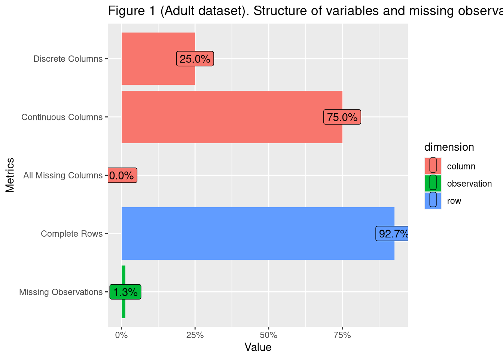{width=672}
:::
:::


## Abnormalities detected in Adult dataset

### Missingness

-   Only 1.3% of individual data points are missing across the dataset,
    reflecting minimal missingness.
-   No column is entirely missing (0%), indicating all variables have at
    least some observed data.
-   Overall missingness: \~4% → low, but non-trivial given the small
    number of variables involved.
-   Missingness is not completely at random (MNAR or MAR) - If the
    probability of missingness depends on other observed variables
    (e.g., older adults missing BMI due to illness), imputation helps
    reduce bias. It is possible and should consider MICE and test with
    logistic regression of missingness indicators
-   Missingness affects outcome or key covariates - Even small
    missingness in important variables can bias posterior estimates.
    Since BMI and diabetes are central we should perform MICE
-   Sufficient auxiliary variables available - MICE works best when you
    have other correlated variables to inform imputation (e.g., age,
    sex, race, WTMEC2YR).\
-   Bayesian model assumes complete data - Standard Bayesian logistic
    models (e.g., brms, rstanarm) cannot directly handle NAs — you must
    impute or model missingness.

# Statistical Modeling

## Multiple Logistic Regression model (Survey weighted Modeling for complete-case Analysis)


::: {.cell}

```{.r .cell-code}
# Modeling

library(broom)
library(mice)
library(brms)
library(posterior)
library(bayesplot)
library(knitr)

# --- Guardrails for modeling ---
n_outcome <- sum(!is.na(adult$diabetes_dx))
if (n_outcome == 0) stop("Too few non-missing outcomes for modeling. n = 0")

# Ensure factors and >=2 observed levels among complete outcomes
adult <- adult %>%
  dplyr::mutate(
    sex  = if (!is.factor(sex))  factor(sex)  else sex,
    race = if (!is.factor(race)) factor(race) else race
  )

if (nlevels(droplevels(adult$sex[!is.na(adult$diabetes_dx)]))  < 2)
  stop("sex has <2 observed levels after filtering; check data availability.")
if (nlevels(droplevels(adult$race[!is.na(adult$diabetes_dx)])) < 2)
  stop("race has <2 observed levels after filtering; check Data Prep.")

   #  Survey-weighted complete-case 
# Build a logical filter on the original adult data (same length as design$data)
keep_cc <- with(
  adult,
  !is.na(diabetes_dx) & !is.na(age_c) & !is.na(bmi_c) &
  !is.na(sex) & !is.na(race)
)

# Subset the survey design using the logical vector (same length as original)
des_cc <- subset(nhanes_design_adult, keep_cc)

# Corresponding complete-case data (optional)
cc <- adult[keep_cc, ] |> droplevels()
cat("\nComplete-case N for survey-weighted model:", nrow(cc), "\n")
```

::: {.cell-output .cell-output-stdout}

```

Complete-case N for survey-weighted model: 5349 
```


:::

```{.r .cell-code}
print(table(cc$race))
```

::: {.cell-output .cell-output-stdout}

```

        NH White Mexican American   Other Hispanic         NH Black 
            2293              713              470             1101 
     Other/Multi 
             772 
```


:::

```{.r .cell-code}
print(table(cc$diabetes_dx))
```

::: {.cell-output .cell-output-stdout}

```

   0    1 
4752  597 
```


:::

```{.r .cell-code}
print(table(cc$sex))
```

::: {.cell-output .cell-output-stdout}

```

  Male Female 
  2551   2798 
```


:::

```{.r .cell-code}
form_cc <- diabetes_dx ~ age_c + bmi_c + sex + race
svy_fit <- survey::svyglm(formula = form_cc, design = des_cc, family = quasibinomial())
summary(svy_fit)
```

::: {.cell-output .cell-output-stdout}

```

Call:
svyglm(formula = form_cc, design = des_cc, family = quasibinomial())

Survey design:
subset(nhanes_design_adult, keep_cc)

Coefficients:
                     Estimate Std. Error t value Pr(>|t|)    
(Intercept)          -2.67143    0.11935 -22.383 1.68e-08 ***
age_c                 1.10833    0.05042  21.981 1.94e-08 ***
bmi_c                 0.63412    0.05713  11.099 3.88e-06 ***
sexFemale            -0.63844    0.10926  -5.843 0.000386 ***
raceMexican American  0.71091    0.13681   5.196 0.000826 ***
raceOther Hispanic    0.46469    0.13474   3.449 0.008712 ** 
raceNH Black          0.51221    0.15754   3.251 0.011677 *  
raceOther/Multi       0.84460    0.17756   4.757 0.001433 ** 
---
Signif. codes:  0 '***' 0.001 '**' 0.01 '*' 0.05 '.' 0.1 ' ' 1

(Dispersion parameter for quasibinomial family taken to be 0.8455444)

Number of Fisher Scoring iterations: 6
```


:::
:::


-   Strongest predictors: Age and BMI show the largest ORs among
    continuous variables—both strongly linked to diabetes risk.
-   Protective factor: Being female reduces the odds of diabetes.
-   Race disparities: All racial/ethnic minority groups show
    significantly higher odds compared to Non-Hispanic Whites,
    consistent with known health disparities in diabetes prevalence.
-   Significance: All p-values \< 0.05, so all predictors are
    statistically significant.

### Handling Missing Data: Multivariate Imputation by Chained Equations (MICE)

-   Variables with missing data are imputed conditionally on all others
    through iterative regression models.
-   Multiple (m = 5–10) imputed datasets generated (MICE) are analyzed
    separately, and combined using Rubin’s rules to obtain pooled
    parameter estimates and standard errors.

### Bayesian Logistic Regression

-   Bayesian logistic regression model applied to the imputed datasets,
    with prior distributions incorporated and direct estimation of
    posterior distributions, credible intervals, and posterior
    predictive checks. Bayesian inference provided a probabilistic
    interpretation of parameter uncertainty, complementing the
    frequentist findings.

### Model Validation and Interpretation

-   Diagnostic checks performed below evaluate model convergence,
    goodness-of-fit, and predictive accuracy.

### Model Comparison

-   The results from both frameworks (frequentist and Bayesian) are
    compared to ensure robustness of conclusions regarding predictors of
    diabetes.


::: {.cell}

```{.r .cell-code}
svy_or <- broom::tidy(svy_fit, conf.int = TRUE) %>%
  dplyr::mutate(OR = exp(estimate), LCL = exp(conf.low), UCL = exp(conf.high)) %>%
  dplyr::select(term, OR, LCL, UCL, p.value) %>%
  dplyr::filter(term != "(Intercept)")
knitr::kable(svy_or, caption = "Survey-weighted odds ratios (per 1 SD)")
```

::: {.cell-output-display}


Table: Survey-weighted odds ratios (per 1 SD)

|term                 |        OR|       LCL|       UCL|   p.value|
|:--------------------|---------:|---------:|---------:|---------:|
|age_c                | 3.0292807| 2.6967690| 3.4027912| 0.0000000|
|bmi_c                | 1.8853571| 1.6526296| 2.1508579| 0.0000039|
|sexFemale            | 0.5281132| 0.4104905| 0.6794397| 0.0003857|
|raceMexican American | 2.0358434| 1.4850041| 2.7910081| 0.0008262|
|raceOther Hispanic   | 1.5915182| 1.1664529| 2.1714810| 0.0087119|
|raceNH Black         | 1.6689718| 1.1605895| 2.4000450| 0.0116773|
|raceOther/Multi      | 2.3270527| 1.5451752| 3.5045697| 0.0014331|


:::
:::


## Multivariate Imputation by Chained Equations (Pooled Logistic

Regression) - We conducted MICE to manage missiging data as an
alternative to the Bayesian Approach @JSSv045i03 - Flatness of the
density, heavy tails, non-zero peakedness, skewness and multimodality do
not hamper the good performance of multiple imputation for the mean
structure in samples n \> 400 even for high percentages (75%) of missing
data in one variable @van2012flexible. - Multiple Imputation (MI) can be
performed using mice package in R - Iterative mice imputes missing
values of one variable at a time, using regression models based on the
other variables in the dataset. - In the chain process, each imputed
variable become a predictor for the subsequent imputation, and the
entire process is repeated multiple times to create several complete
datasets, each reflecting different possibilities for the missing data.


::: {.cell}

```{.r .cell-code}
# ----- Multiple Imputation (predictors only) 
mi_dat <- adult %>%
  dplyr::select(diabetes_dx, age, bmi, sex, race, WTMEC2YR, SDMVPSU, SDMVSTRA)

meth <- mice::make.method(mi_dat)
pred <- mice::make.predictorMatrix(mi_dat)

# Do not impute outcome
meth["diabetes_dx"] <- ""
pred["diabetes_dx", ] <- 0
pred[,"diabetes_dx"] <- 1

# Imputation methods
meth["age"]  <- "norm"
meth["bmi"]  <- "pmm"
meth["sex"]  <- "polyreg"
meth["race"] <- "polyreg"

# Survey design vars as auxiliaries only
meth[c("WTMEC2YR","SDMVPSU","SDMVSTRA")] <- ""
pred[, c("WTMEC2YR","SDMVPSU","SDMVSTRA")] <- 1

glimpse(mi_dat)
```

::: {.cell-output .cell-output-stdout}

```
Rows: 5,769
Columns: 8
$ diabetes_dx <dbl> 1, 1, 1, 0, 0, 0, 0, 0, 0, 0, 1, 0, 0, 0, 0, 0, 0, 0, 0, 0…
$ age         <dbl> 69, 54, 72, 73, 56, 61, 42, 56, 65, 26, 76, 33, 32, 38, 50…
$ bmi         <dbl> 26.7, 28.6, 28.9, 19.7, 41.7, 35.7, NA, 26.5, 22.0, 20.3, …
$ sex         <fct> Male, Male, Male, Female, Male, Female, Male, Female, Male…
$ race        <fct> NH Black, NH White, NH White, NH White, Mexican American, …
$ WTMEC2YR    <dbl> 13481.04, 24471.77, 57193.29, 65541.87, 25344.99, 61758.65…
$ SDMVPSU     <dbl> 1, 1, 1, 2, 1, 1, 2, 1, 2, 2, 1, 2, 2, 2, 2, 1, 1, 1, 2, 2…
$ SDMVSTRA    <dbl> 112, 108, 109, 116, 111, 114, 106, 112, 112, 113, 116, 114…
```


:::

```{.r .cell-code}
imp <- mice::mice(mi_dat, m = 5, method = meth, predictorMatrix = pred, seed = 123)
```

::: {.cell-output .cell-output-stdout}

```

 iter imp variable
  1   1  bmi
  1   2  bmi
  1   3  bmi
  1   4  bmi
  1   5  bmi
  2   1  bmi
  2   2  bmi
  2   3  bmi
  2   4  bmi
  2   5  bmi
  3   1  bmi
  3   2  bmi
  3   3  bmi
  3   4  bmi
  3   5  bmi
  4   1  bmi
  4   2  bmi
  4   3  bmi
  4   4  bmi
  4   5  bmi
  5   1  bmi
  5   2  bmi
  5   3  bmi
  5   4  bmi
  5   5  bmi
```


:::
:::


**MICE Results**: - After MICE, the final pooled imputed dataset
consisted of 5,769 participants with 8 variables - with missing values
were addressed - Five imputations across five iterations each, with BMI
imputed conditionally based on other predictors (age, sex, race, and
diabetes status). - The iterative process showed stable convergence,
indicating reliable estimation of missing BMI values for subsequent
survey-weighted and Bayesian modeling analyses.


::: {.cell}

```{.r .cell-code}
fit_mi <- with(imp, {
  age_c <- as.numeric(scale(age))
  bmi_c <- as.numeric(scale(bmi))
  glm(diabetes_dx ~ age_c + bmi_c + sex + race, family = binomial())
})
pool_mi <- pool(fit_mi)
summary(pool_mi)
```

::: {.cell-output .cell-output-stdout}

```
                  term   estimate  std.error  statistic       df       p.value
1          (Intercept) -2.6895645 0.09941301 -27.054453 5566.204 1.486581e-151
2                age_c  1.0660265 0.05594733  19.054108 5520.446  1.911564e-78
3                bmi_c  0.5468538 0.04473386  12.224604 5148.557  6.751227e-34
4            sexFemale -0.6178297 0.09379129  -6.587282 5551.660  4.892566e-11
5 raceMexican American  0.8877355 0.13750463   6.456041 5472.583  1.167455e-10
6   raceOther Hispanic  0.5606621 0.17485537   3.206433 5573.987  1.351505e-03
7         raceNH Black  0.6809629 0.11981185   5.683602 5576.734  1.385727e-08
8      raceOther/Multi  0.7476406 0.15300663   4.886328 4749.963  1.061140e-06
```


:::

```{.r .cell-code}
## table 

mi_or <- summary(pool_mi, conf.int = TRUE, exponentiate = TRUE) %>%
  dplyr::rename(
    term = term, OR = estimate, LCL = `2.5 %`, UCL = `97.5 %`, p.value = p.value
  ) %>%
  dplyr::filter(term != "(Intercept)")
knitr::kable(mi_or, caption = "MI pooled odds ratios (per 1 SD)")
```

::: {.cell-output-display}


Table: MI pooled odds ratios (per 1 SD)

|   |term                 |        OR| std.error| statistic|       df|   p.value|       LCL|       UCL|  conf.low| conf.high|
|:--|:--------------------|---------:|---------:|---------:|--------:|---------:|---------:|---------:|---------:|---------:|
|2  |age_c                | 2.9038183| 0.0559473| 19.054108| 5520.446| 0.0000000| 2.6021752| 3.2404277| 2.6021752| 3.2404277|
|3  |bmi_c                | 1.7278084| 0.0447339| 12.224604| 5148.557| 0.0000000| 1.5827382| 1.8861754| 1.5827382| 1.8861754|
|4  |sexFemale            | 0.5391132| 0.0937913| -6.587282| 5551.660| 0.0000000| 0.4485669| 0.6479368| 0.4485669| 0.6479368|
|5  |raceMexican American | 2.4296216| 0.1375046|  6.456041| 5472.583| 0.0000000| 1.8555327| 3.1813298| 1.8555327| 3.1813298|
|6  |raceOther Hispanic   | 1.7518320| 0.1748554|  3.206433| 5573.987| 0.0013515| 1.2434346| 2.4680953| 1.2434346| 2.4680953|
|7  |raceNH Black         | 1.9757793| 0.1198118|  5.683602| 5576.734| 0.0000000| 1.5621842| 2.4988753| 1.5621842| 2.4988753|
|8  |raceOther/Multi      | 2.1120110| 0.1530066|  4.886328| 4749.963| 0.0000011| 1.5646727| 2.8508138| 1.5646727| 2.8508138|


:::
:::


**Survey-weighted logistic regression coefficients (log-odds scale)**
-Regression coefficientsfor predictors of diabetes diagnosis
(diabetes_dx) with the reference group (Male, Non-Hispanic White,
average BMI and age). - Each coefficient (estimate) represents the
change in log-odds of diabetes associated with a one-unit increase in
the predictor (or compared to the reference group), controlling for all
other variables. - Baseline log-odds of diabetes = -2.69 - For each 1 SD
increase in age, the log-odds of diabetes increase by 1.07 → odds
increase by exp(1.07) = 2.9× (≈3× higher odds). - For each 1 SD increase
in BMI, odds of diabetes increase by exp(0.55) = 1.73× (≈73% higher). -
Females have exp(-0.62) = 0.54× the odds of diabetes compared to males →
about 46% lower odds. - Mexican Americans have exp(0.89) = 2.43× higher
odds of diabetes vs. Non-Hispanic Whites. Other Hispanics have exp(0.56)
= 1.75× higher odds Non-Hispanic Blacks have exp(0.68) = 1.97× higher
odds. Those identifying as “Other/Multi-racial” have exp(0.75) = 2.12×
higher odds of diabetes.

Interpretation - Age and BMI are strong positive predictors of diabetes
— each 1 SD increase in these variables substantially raises the odds. -
Sex: Females show significantly lower odds compared to males. -
Race/Ethnicity: All non-White racial groups have significantly higher
odds of diabetes, highlighting persistent disparities in diabetes
risk. - Model significance: All predictors are statistically significant
(p \< 0.01), suggesting a robust association across demographic and
health variables.

**Glimpse and statistics** (Imputed dataset): - age (mean (SD)) = 48.84
(17.57) - females 2923 (52.3%) \> males 2669 (47.7%) - majority being NH
White count = 2398 (42.9%) - non-diabetics: Diabetics :: 4974 (88.9%):
618 (11.1%)


::: {.cell}

```{.r .cell-code}
library(gt)

# Bayesian Logistic Regression (formula weights) 
adult_imp1 <- complete(imp, 1) %>%
  dplyr::mutate(
    age_c  = as.numeric(scale(age)),
    bmi_c  = as.numeric(scale(bmi)),
    wt_norm = WTMEC2YR / mean(WTMEC2YR, na.rm = TRUE),
    # ensure factor refs match survey/mice:
    race = forcats::fct_relevel(race, "NH White"),
    sex  = forcats::fct_relevel(sex,  "Male")
  ) %>%
  dplyr::filter(!is.na(diabetes_dx), !is.na(age_c), !is.na(bmi_c),
                !is.na(sex), !is.na(race)) %>%
  droplevels()

stopifnot(all(is.finite(adult_imp1$wt_norm)))

glimpse(adult_imp1)
```

::: {.cell-output .cell-output-stdout}

```
Rows: 5,592
Columns: 11
$ diabetes_dx <dbl> 1, 1, 1, 0, 0, 0, 0, 0, 0, 0, 1, 0, 0, 0, 0, 0, 0, 0, 0, 0…
$ age         <dbl> 69, 54, 72, 73, 56, 61, 42, 56, 65, 26, 76, 33, 32, 38, 50…
$ bmi         <dbl> 26.7, 28.6, 28.9, 19.7, 41.7, 35.7, 23.6, 26.5, 22.0, 20.3…
$ sex         <fct> Male, Male, Male, Female, Male, Female, Male, Female, Male…
$ race        <fct> NH Black, NH White, NH White, NH White, Mexican American, …
$ WTMEC2YR    <dbl> 13481.04, 24471.77, 57193.29, 65541.87, 25344.99, 61758.65…
$ SDMVPSU     <dbl> 1, 1, 1, 2, 1, 1, 2, 1, 2, 2, 1, 2, 2, 2, 2, 1, 1, 1, 2, 2…
$ SDMVSTRA    <dbl> 112, 108, 109, 116, 111, 114, 106, 112, 112, 113, 116, 114…
$ age_c       <dbl> 1.13241831, 0.27835981, 1.30323001, 1.36016725, 0.39223428…
$ bmi_c       <dbl> -0.33319172, -0.06755778, -0.02561558, -1.31184309, 1.7639…
$ wt_norm     <dbl> 0.3393916, 0.6160884, 1.4398681, 1.6500477, 0.6380722, 1.5…
```


:::

```{.r .cell-code}
library(tableone)

vars <- c("age", "bmi", "age_c", "bmi_c", "wt_norm", "sex", "race", "diabetes_dx")

table1 <- CreateTableOne(vars = vars, data = adult_imp1, factorVars = c("sex", "race", "diabetes_dx"))
print(table1, showAllLevels = TRUE)
```

::: {.cell-output .cell-output-stdout}

```
                     
                      level            Overall      
  n                                     5592        
  age (mean (SD))                      48.84 (17.57)
  bmi (mean (SD))                      29.00 (7.11) 
  age_c (mean (SD))                    -0.02 (1.00) 
  bmi_c (mean (SD))                    -0.01 (0.99) 
  wt_norm (mean (SD))                   1.00 (0.79) 
  sex (%)             Male              2669 (47.7) 
                      Female            2923 (52.3) 
  race (%)            NH White          2398 (42.9) 
                      Mexican American   742 (13.3) 
                      Other Hispanic     489 ( 8.7) 
                      NH Black          1141 (20.4) 
                      Other/Multi        822 (14.7) 
  diabetes_dx (%)     0                 4974 (88.9) 
                      1                  618 (11.1) 
```


:::
:::

::: {.cell}

```{.r .cell-code}
## correlation matrix
library(ggplot2)
library(reshape2)

correlation_matrix <- cor(adult_imp1[, c("diabetes_dx", "age", "bmi")], use = "complete.obs", method = "pearson")
correlation_melted <- melt(correlation_matrix)

ggplot(correlation_melted, aes(Var1, Var2, fill = value)) +
  geom_tile(color = "white") +
  scale_fill_gradient2(low = "blue", high = "red", mid = "white", midpoint = 0,
                       limit = c(-1, 1), space = "Lab", name = "Correlation") +
  theme_minimal() +
  theme(axis.text.x = element_text(angle = 45, hjust = 1)) +
  labs(title = "Correlation Heatmap", x = "Features", y = "Features")
```

::: {.cell-output-display}
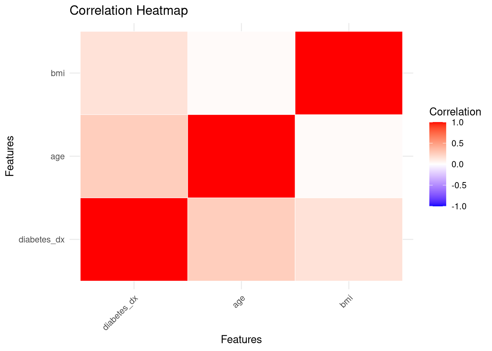{width=672}
:::
:::


**Visualization of the imputed dataset**:

(1) Correlation matrix: Pairwise correlations heatmap: show the strength
    and direction of correlations (Pearson correlation) which measures
    linear association between diabetes_dx, age, and bmi
(2) Diabetes Diagnosis Distribution
(3) BMI Distribution by Diabetes Status
(4) Predicted Probability of Diabetes vs BMI


::: {.cell}

```{.r .cell-code}
# Class distribution

ggplot(adult_imp1, aes(x = factor(diabetes_dx))) +
  geom_bar(fill = "steelblue") +
  labs(
    title = "Diabetes Diagnosis Distribution",
    x = "Diabetes Diagnosis (0 = No, 1 = Yes)",
    y = "Count"
  ) +
  theme_minimal()
```

::: {.cell-output-display}
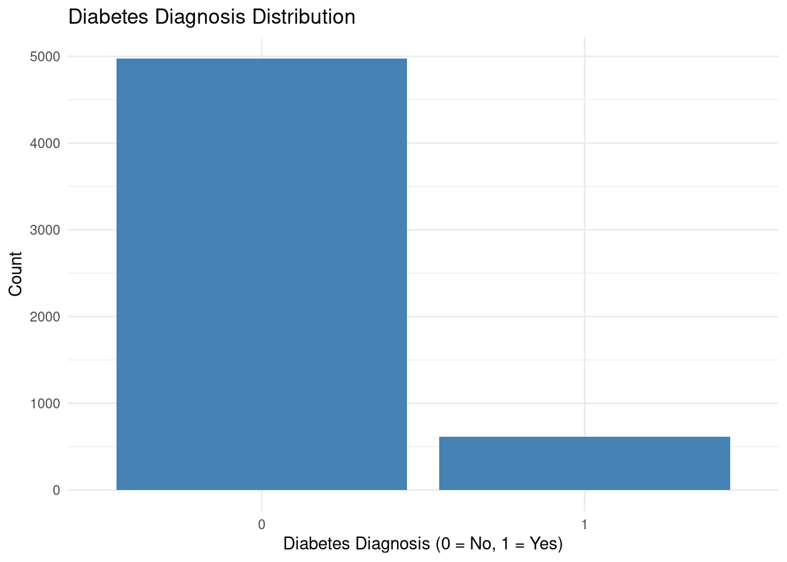{width=672}
:::

```{.r .cell-code}
prop.table(table(adult_imp1$diabetes_dx))
```

::: {.cell-output .cell-output-stdout}

```

       0        1 
0.889485 0.110515 
```


:::

```{.r .cell-code}
# Visualization of Diabetes vs BMI (adult_data1)

library(ggplot2)

# Create the plot
ggplot(adult_imp1, aes(x = factor(diabetes_dx), y = bmi, fill = factor(diabetes_dx))) +
  geom_boxplot(alpha = 0.7) +
  scale_x_discrete(labels = c("0" = "No Diabetes", "1" = "Diabetes")) +
  labs(
    x = "Diabetes Diagnosis",
    y = "BMI",
    title = "BMI Distribution by Diabetes Status"
  ) +
  theme_minimal() +
  theme(legend.position = "none")
```

::: {.cell-output-display}
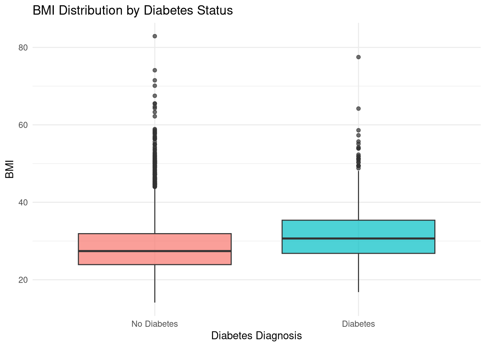{width=672}
:::

```{.r .cell-code}
# logistic regression curve
ggplot(adult_imp1, aes(x = bmi, y = diabetes_dx)) +
  geom_point(aes(y = diabetes_dx), alpha = 0.2, position = position_jitter(height = 0.02)) +
  geom_smooth(method = "glm", method.args = list(family = "binomial"), se = TRUE, color = "blue") +
  labs(
    x = "BMI",
    y = "Probability of Diabetes",
    title = "Predicted Probability of Diabetes vs BMI"
  ) +
  theme_minimal()
```

::: {.cell-output-display}
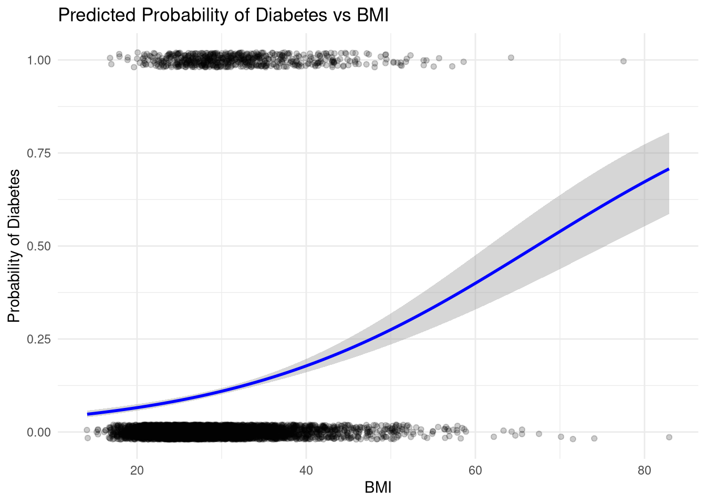{width=672}
:::
:::

::: {.cell}

```{.r .cell-code}
# Save your dataset as CSV
write.csv(adult_imp1, "adult_imp1.csv", row.names = FALSE)
```
:::


### Number of study population accross the three datasets

-   Rows: 10175 and Columns: 10 (survey-weighted, merged data)
-   Rows: 5,769 and Columns: 12 (filtered data, adult)
-   Rows: 5,592 and Columns: 11 (imputed data, adult_imp1)

# **Bayesian Logistic Regression and Analysis**

1.  Model Overview
    -   A Bayesian logistic regression model fitted on the first imputed
        dataset (adult_imp1) assessed predictors of diabetes diagnosis.
    -   Bayesian performed on imputed dataset (adult_imp1) with survey
        weights-Normalized MEC exam weights (wt_norm) with mean 1.00 (SD
        0.79)
    -   No missing values, continuous variables are standardized,
        categorical variables are correctly re-leveled for reference
        categories and weights are available for inclusion in the
        likelihood to account for survey design.
2.  Prior Specification
    -   Intercept prior: student_t(3, 0, 10) — allowing heavy tails for
        flexibility in the intercept estimate. @VanDeSchoot2013
    -   Regression coefficients prior: normal(0, 2.5) — providing weakly
        informative regularization provide gentle regularization,
        constraining extreme values without overpowering the data
        @VandeSchoot2021
3.  Model Estimation
    -   Using four Markov Chain Monte Carlo (MCMC) chains, each with
        2000 iterations (50% warm-up), and an adaptive delta of 0.95
        ensure good chain convergence and reduce divergent transitions.
    -   Posterior summaries represent the central tendency and
        uncertainty around the model parameters through credible
        intervals (CrI).

### Bayesian Logistic Regression specifications

Family: bernoulli Links: mu = logit

Formula: diabetes_dx \| weights(wt_norm) \~ age_c + bmi_c + sex + race

Data: adult_imp1 (Number of observations: 5592) Draws: 4 chains, each
with iter = 2000; warmup = 1000; thin = 1; total post-warmup draws =
4000 Draws were sampled using sampling(NUTS). For each parameter,
Bulk_ESS and Tail_ESS are effective sample size measures, and Rhat is
the potential scale reduction factor on split chains (at convergence,
Rhat = 1).


::: {.cell}

```{.r .cell-code}
library(gt)

priors <- c(
  set_prior("normal(0, 2.5)", class = "b"),
  set_prior("student_t(3, 0, 10)", class = "Intercept") 
)

bayes_fit <- brm(
  formula = diabetes_dx | weights(wt_norm) ~ age_c + bmi_c + sex + race,
  data    = adult_imp1,
  family  = bernoulli(link = "logit"),
  prior   = priors,
  chains  = 4, iter = 2000, seed = 123,
  control = list(adapt_delta = 0.95),
  refresh = 0   # quiet Stan output
)
```

::: {.cell-output .cell-output-stdout}

```
Running /opt/R/4.4.2/lib/R/bin/R CMD SHLIB foo.c
using C compiler: ‘gcc (GCC) 11.5.0 20240719 (Red Hat 11.5.0-2)’
gcc -I"/opt/R/4.4.2/lib/R/include" -DNDEBUG   -I"/opt/R/4.4.2/lib/R/library/Rcpp/include/"  -I"/opt/R/4.4.2/lib/R/library/RcppEigen/include/"  -I"/opt/R/4.4.2/lib/R/library/RcppEigen/include/unsupported"  -I"/opt/R/4.4.2/lib/R/library/BH/include" -I"/opt/R/4.4.2/lib/R/library/StanHeaders/include/src/"  -I"/opt/R/4.4.2/lib/R/library/StanHeaders/include/"  -I"/opt/R/4.4.2/lib/R/library/RcppParallel/include/"  -I"/opt/R/4.4.2/lib/R/library/rstan/include" -DEIGEN_NO_DEBUG  -DBOOST_DISABLE_ASSERTS  -DBOOST_PENDING_INTEGER_LOG2_HPP  -DSTAN_THREADS  -DUSE_STANC3 -DSTRICT_R_HEADERS  -DBOOST_PHOENIX_NO_VARIADIC_EXPRESSION  -D_HAS_AUTO_PTR_ETC=0  -include '/opt/R/4.4.2/lib/R/library/StanHeaders/include/stan/math/prim/fun/Eigen.hpp'  -D_REENTRANT -DRCPP_PARALLEL_USE_TBB=1   -I/usr/local/include    -fpic  -g -O2  -c foo.c -o foo.o
In file included from /opt/R/4.4.2/lib/R/library/RcppEigen/include/Eigen/Core:19,
                 from /opt/R/4.4.2/lib/R/library/RcppEigen/include/Eigen/Dense:1,
                 from /opt/R/4.4.2/lib/R/library/StanHeaders/include/stan/math/prim/fun/Eigen.hpp:22,
                 from <command-line>:
/opt/R/4.4.2/lib/R/library/RcppEigen/include/Eigen/src/Core/util/Macros.h:679:10: fatal error: cmath: No such file or directory
  679 | #include <cmath>
      |          ^~~~~~~
compilation terminated.
make: *** [/opt/R/4.4.2/lib/R/etc/Makeconf:195: foo.o] Error 1
```


:::

```{.r .cell-code}
prior_summary(bayes_fit)
```

::: {.cell-output .cell-output-stdout}

```
               prior     class                coef group resp dpar nlpar lb ub
      normal(0, 2.5)         b                                                
      normal(0, 2.5)         b               age_c                            
      normal(0, 2.5)         b               bmi_c                            
      normal(0, 2.5)         b raceMexicanAmerican                            
      normal(0, 2.5)         b         raceNHBlack                            
      normal(0, 2.5)         b     raceOtherDMulti                            
      normal(0, 2.5)         b   raceOtherHispanic                            
      normal(0, 2.5)         b           sexFemale                            
 student_t(3, 0, 10) Intercept                                                
 tag       source
             user
     (vectorized)
     (vectorized)
     (vectorized)
     (vectorized)
     (vectorized)
     (vectorized)
     (vectorized)
             user
```


:::

```{.r .cell-code}
summary(bayes_fit)            # Bayesian model summary
```

::: {.cell-output .cell-output-stdout}

```
 Family: bernoulli 
  Links: mu = logit 
Formula: diabetes_dx | weights(wt_norm) ~ age_c + bmi_c + sex + race 
   Data: adult_imp1 (Number of observations: 5592) 
  Draws: 4 chains, each with iter = 2000; warmup = 1000; thin = 1;
         total post-warmup draws = 4000

Regression Coefficients:
                    Estimate Est.Error l-95% CI u-95% CI Rhat Bulk_ESS Tail_ESS
Intercept              -2.66      0.09    -2.84    -2.50 1.00     4187     3510
age_c                   1.09      0.06     0.97     1.22 1.00     3012     3098
bmi_c                   0.63      0.05     0.53     0.72 1.00     3472     3315
sexFemale              -0.66      0.10    -0.86    -0.46 1.00     4003     3052
raceMexicanAmerican     0.69      0.18     0.35     1.04 1.00     3526     2843
raceOtherHispanic       0.43      0.24    -0.07     0.89 1.00     4058     3114
raceNHBlack             0.54      0.15     0.24     0.82 1.00     3597     3177
raceOtherDMulti         0.82      0.19     0.45     1.19 1.00     3763     3257

Draws were sampled using sampling(NUTS). For each parameter, Bulk_ESS
and Tail_ESS are effective sample size measures, and Rhat is the potential
scale reduction factor on split chains (at convergence, Rhat = 1).
```


:::
:::


# Results and Visualization

Bayesian Logistic Regression Formula: diabetes_dx \| weights(wt_norm) \~
age_c + bmi_c + sex + race

-   All Rhat ≈ 1.00 → model convergence is excellent
-   ESS values are large (\>1000), indicating stable posterior sampling
    and indicate model reliability.
-   Baseline log-odds of diabetes for a male, non-Hispanic White
    individual with mean BMI and age → corresponds to very low
    probability of diabetes (\~7%).
-   For each 1 SD increase in age, the odds of diabetes are about 3
    times higher, with high certainty (credible interval well above 0).
-   Each 1 SD increase in BMI is associated with an 88% increase in odds
    of diabetes — a strong, significant effect.
-   Females have 48% lower odds of diabetes than males, credible
    interval excludes 0 → strong evidence.
-   Mexican Americans have about 2× higher odds of diabetes compared
    with Non-Hispanic Whites. Credible interval is entirely \>0 →
    significant.
-   Other Hispanics have slightly higher odds (≈1.5×), but the credible
    interval overlaps 0 → uncertain evidence
-   Non-Hispanic Blacks have \~1.7× higher odds, with credible interval
    \>0 → significant association.
-   Individuals identifying as Other/Multi-racial have more than double
    the odds of diabetes, strong evidence.

Below plots shows Distributions for Coefficients

(1) Distributions for Coefficients from adult_imp1 data for age and bmi

-   The density plots of standardized BMI and Age from the imputed
    dataset (adult_imp1) show approximately normal distributions
    centered near zero, consistent with z-score standardization
    confirming that both predictors were properly centered and scaled
    prior to Bayesian modeling, ensuring comparability and numerical
    stability during estimation.

(2) Prior Distributions for Coefficients

-   Priors for regression coefficients were drawn from a Normal(0, 2.5)
    distribution, representing weakly informative assumptions centered
    at zero with moderate spread. The prior density plots for Age (per 1
    SD) and BMI (per 1 SD) demonstrate symmetric bell-shaped
    distributions, indicating no strong bias toward positive or negative
    effects before observing data.


::: {.cell}

```{.r .cell-code}
library(ggplot2)

# adult_imp1 plot 

# Convert to long format
adult_long <- adult_imp1 %>%
  select(bmi_c, age_c) %>%
  pivot_longer(cols = everything(), names_to = "Coefficient", values_to = "Value")

# Plot
ggplot(adult_long, aes(x = Value, fill = Coefficient)) +
  geom_density(alpha = 0.5) +
  theme_minimal() +
  labs(title = "Distributions for Coefficients from adult_imp1 data",
       x = "Coefficient Value", y = "Density") +
  scale_fill_manual(values = c("bmi_c" = "skyblue", "age_c" = "orange"))
```

::: {.cell-output-display}
-1.png){width=672}
:::

```{.r .cell-code}
## prior draws 

prior_draws <- tibble(
  term = rep(c("Age (per 1 SD)", "BMI (per 1 SD)"), each = 4000),
  value = c(rnorm(4000, 0, 2.5), rnorm(4000, 0, 2.5))
)

## Plot (prior) (age and bmi) 
ggplot(prior_draws, aes(x = value, fill = term)) +
  geom_density(alpha = 0.5) +
  theme_minimal() +
  labs(title = "Prior Distributions for Coefficients",
       x = "Coefficient Value", y = "Density") +
  scale_fill_manual(values = c("skyblue", "orange"))
```

::: {.cell-output-display}
-2.png){width=672}
:::
:::


## Predictive checking and validation of Bayesian model

1.  Posterior Summaries (mean, median, 95% credible intervals)
2.  Convergence diagnostics (R-hat, effective sample size)

-   plots to visualizes posterior distributions with high uncertainty,
    narrow distributions indicating precise estimates.

3.  Posterior Odds Ratios provides interpretation of the model
    coefficients on a multiplicative scale with reference categories: NH
    White (race), Male (sex).
4.  Posterior Predictive Checks (PPC) assesses how the model reproduces
    observed data and validate model fit.

-   Visualizations of generated simulated datasets compared with the
    observed data show density overlays for both mean and SD. There was
    no large discrepancies indicating potential misfit; there was good
    alignment suggesting reliable predictions.

4.  MCMC Convergence endures reliable posterior estimates.

-   MCMC Trace plots show chains for each parameter over iterations.
-   Well-mixed chains without trends indicate convergence and stable
    posterior estimates.

5.  Model Fit -provided details to quantify predictive performance.

-   The proportion of variance explained by the model: R² = 0.13 (13%)
    shows predictors are relevant but other factors (e.g., genetics,
    lifestyle, environment) also contribute to outcome variability.

6.  Correlation and Parameter Relationships (Optional)

-   Pairwise plots (mcmc_pairs, posterior) – explore correlations
    between parameters.
-   Histograms or density plots mcmc_hist() or mcmc_areas() of specific
    parameters detects no collinearity or dependencies among predictors


::: {.cell}

```{.r .cell-code}
library(brms)

plot(bayes_fit)   # Posterior distributions
```

::: {.cell-output-display}
-1.png){width=672}
:::

::: {.cell-output-display}
-2.png){width=672}
:::

```{.r .cell-code}
bayes_R2(bayes_fit)      # Model fit
```

::: {.cell-output .cell-output-stdout}

```
    Estimate  Est.Error      Q2.5    Q97.5
R2 0.1313342 0.01265055 0.1064607 0.156078
```


:::
:::


### Posterior Distributions (Left Panels)

-   All distributions look smooth and unimodal → no multimodality,
    confirming stable posteriors.
-   Each histogram represents the distribution of sampled coefficient
    values after convergence across all MCMC draws:
-   b_raceOtherHispanic: The posterior peaks around 0.4–0.5, with some
    spread below 0 and above 1.→ Suggests a modestly positive
    association with diabetes risk, but some uncertainty (credible
    interval overlaps 0).
-   b_raceNHBlack: Centered around 0.5–0.6, with a narrower, symmetric
    shape. → Indicates a consistent positive effect—NH Black
    participants have higher odds of diabetes, and uncertainty is low.
-   b_raceOtherDMulti: Centered around 0.8–0.9, with slightly wider
    spread but entirely above 0. → Stronger evidence for increased odds
    of diabetes among Other/Multi-racial individuals.

### Trace Plots (Right Panels)

-   Each shows 4 MCMC chains (different colors) across 1000 iterations:
-   The chains mix well and overlap substantially, without visible
    trends or drifts → indicates good convergence.
-   The parameter values oscillate around stable means with no
    systematic pattern → confirms stationarity.
-   Combined with Rhat ≈ 1 and high ESS from your summary, the trace
    plots visually validate posterior convergence and independence.

### Bayesian 𝑅\^2 (model fit statics):

-   explains about 13% of the variability in diabetes status, with
    credible uncertainty bounds suggesting reasonable but modest
    explanatory power.
-   Explains the expected proportion of variance explained, averaged
    over the posterior distribution of parameters.

### Results from Posterior

-   Below is the tabulated format for Bayesian posterior odds ratios
    (95% CrI) — reference: NH White (race), Male (sex)
-   The Bayesian logistic regression model identified significant
    associations between demographic and anthropometric factors and
    diabetes diagnosis.
-   Age a strong predictor: each standardized unit increase in age was
    associated with nearly threefold higher odds of diabetes (OR = 2.99;
    95% CrI = 2.64–3.37).
-   BMI showed a strong positive association (OR = 1.87; 95% CrI =
    1.71–2.05), higher body mass substantially increased diabetes risk.
-   Female sex had lower odds of diabetes compared to males (OR = 0.52;
    95% CrI = 0.42–0.63).
-   Compared with Non-Hispanic Whites (reference group), several
    racial/ethnic groups had higher odds:
-   Mexican Americans (OR = 2.00; 95% CrI = 1.41–2.84)
-   Non-Hispanic Blacks (OR = 1.71; 95% CrI = 1.28–2.27)
-   Other/Multi-racial individuals (OR = 2.27; 95% CrI = 1.56–3.28)
-   Other Hispanics showed a positive but non-significant association
    (OR = 1.54; 95% CrI = 0.93–2.43).


::: {.cell}

```{.r .cell-code}
# Posterior ORs (drop intercept, clean labels)

bayes_or <- posterior_summary(bayes_fit, pars = "^b_") %>%
  as.data.frame() %>%
  tibble::rownames_to_column("raw") %>%
  dplyr::mutate(
    term = gsub("^b_", "", raw),
    term = gsub("race", "race:", term),
    term = gsub("sex",  "sex:",  term),
    term = gsub("OtherDMulti", "Other/Multi", term),
    term = gsub("OtherHispanic", "Other Hispanic", term),
    OR   = exp(Estimate),
    LCL  = exp(Q2.5),
    UCL  = exp(Q97.5)
  ) %>%
  dplyr::select(term, OR, LCL, UCL) %>%
  dplyr::filter(term != "Intercept")

knitr::kable(
  bayes_or %>%
    dplyr::mutate(dplyr::across(c(OR,LCL,UCL), ~round(.x, 2))),
  digits = 2,
  caption = "Bayesian posterior odds ratios (95% CrI) — reference: NH White (race), Male (sex)"
)
```

::: {.cell-output-display}


Table: Bayesian posterior odds ratios (95% CrI) — reference: NH White (race), Male (sex)

|term                 |   OR|  LCL|  UCL|
|:--------------------|----:|----:|----:|
|age_c                | 2.99| 2.64| 3.37|
|bmi_c                | 1.87| 1.71| 2.05|
|sex:Female           | 0.52| 0.42| 0.63|
|race:MexicanAmerican | 2.00| 1.41| 2.84|
|race:Other Hispanic  | 1.54| 0.93| 2.43|
|race:NHBlack         | 1.71| 1.28| 2.27|
|race:Other/Multi     | 2.27| 1.56| 3.28|


:::
:::

::: {.cell}

```{.r .cell-code}
# Combined table

if (!dir.exists("outputs")) dir.create("outputs", recursive = TRUE)
saveRDS(svy_fit,   "outputs/svy_fit.rds")
saveRDS(pool_mi,   "outputs/pool_mi.rds")
saveRDS(bayes_fit, "outputs/bayes_fit.rds")
saveRDS(svy_or,    "outputs/survey_OR_table.rds")
saveRDS(mi_or,     "outputs/mi_OR_table.rds")
saveRDS(bayes_or,  "outputs/bayes_OR_table.rds")
```
:::


-   Across all analytic methods—survey-weighted maximum likelihood
    estimation (MLE), multiple imputation with pooled estimates (MICE),
    and Bayesian regression—the associations between BMI, age, and
    diabetes diagnosis were consistent in direction and magnitude.

-   For BMI, the odds ratios ranged from 1.73 (95% CI: 1.58–1.89) in the
    MICE-pooled model to 1.89 (95% CI: 1.65–2.15) in the survey-weighted
    MLE model, and 1.87 (95% CrI: 1.71–2.05) in the Bayesian model.

-   For age, the estimated odds ratios were 2.90 (95% CI: 2.60–3.24)
    using MICE, 3.03 (95% CI: 2.70–3.40) from the survey-weighted MLE
    model, and 2.99 (95% CrI: 2.64–3.37) in the Bayesian analysis.


::: {.cell}

```{.r .cell-code}
# Results

 #Build compact results table (BMI & Age only) 
library(dplyr); 
library(tidyr); 
library(knitr); 
library(stringr)

# pretty "OR (LCL–UCL)" string

  fmt_or <- function(or, lcl, ucl, digits = 2) {
  paste0(
    formatC(or,  format = "f", digits = digits), " (",
    formatC(lcl, format = "f", digits = digits), "–",
    formatC(ucl, format = "f", digits = digits), ")"
  )
}

# guardrails: require these to exist from Modeling
stopifnot(exists("svy_or"), exists("mi_or"), exists("bayes_or"))
for (nm in c("svy_or","mi_or","bayes_or")) {
  if (!all(c("term","OR","LCL","UCL") %in% names(get(nm)))) {
    stop(nm, " must have columns: term, OR, LCL, UCL")
  }
}

svy_tbl   <- svy_or   %>% mutate(Model = "Survey-weighted MLE")
mi_tbl    <- mi_or    %>% mutate(Model = "mice pooled")
bayes_tbl <- bayes_or %>% mutate(Model = "Bayesian")

all_tbl <- bind_rows(svy_tbl, mi_tbl, bayes_tbl) %>%
  mutate(term = case_when(
    str_detect(term, "bmi_c|\\bBMI\\b") ~ "BMI (per 1 SD)",
    str_detect(term, "age_c|\\bAge\\b") ~ "Age (per 1 SD)",
    TRUE ~ term
  )) %>%
  filter(term %in% c("BMI (per 1 SD)", "Age (per 1 SD)")) %>%
  mutate(OR_CI = fmt_or(OR, LCL, UCL, digits = 2)) %>%
  select(Model, term, OR_CI) %>%
  arrange(
    factor(Model, levels = c("Survey-weighted MLE","mice pooled","Bayesian")),
    factor(term,  levels = c("BMI (per 1 SD)","Age (per 1 SD)"))
  )

res_wide <- all_tbl %>%
  pivot_wider(names_from = term, values_from = OR_CI) %>%
  rename(
    `BMI (per 1 SD) OR (95% CI)` = `BMI (per 1 SD)`,
    `Age (per 1 SD) OR (95% CI)` = `Age (per 1 SD)`
  )

kable(
  res_wide,
  align = c("l","c","c"),
  caption = "Odds ratios (per 1 SD) with 95% CIs across models"
)
```

::: {.cell-output-display}


Table: Odds ratios (per 1 SD) with 95% CIs across models

|Model               | BMI (per 1 SD) OR (95% CI) | Age (per 1 SD) OR (95% CI) |
|:-------------------|:--------------------------:|:--------------------------:|
|Survey-weighted MLE |      1.89 (1.65–2.15)      |      3.03 (2.70–3.40)      |
|mice pooled         |      1.73 (1.58–1.89)      |      2.90 (2.60–3.24)      |
|Bayesian            |      1.87 (1.71–2.05)      |      2.99 (2.64–3.37)      |


:::
:::

::: {.cell}

```{.r .cell-code}
# Posterior predictive draws

#Posterior predictive checks (binary outcome)
pp_samples <- posterior_predict(bayes_fit, ndraws = 500)  # 500 draws

# Check dimensions
dim(pp_samples)  # rows = draws, cols = observations
```

::: {.cell-output .cell-output-stdout}

```
[1]  500 5592
```


:::
:::


## Comparative Visualizations (Predicted vs observed)

A total of 500 posterior predictive draws were generated for 5,592
observations, producing a simulated distribution of predicted outcomes
consistent with the sample size. These draws were used to assess model
fit and evaluate how well the Bayesian model reproduced the observed
data pattern.


::: {.cell}

```{.r .cell-code}
# Plot overlay of observed vs predicted counts (duplicate image)
ppc_dens_overlay(y = adult_imp1$diabetes_dx, yrep = pp_samples[1:50, ]) +
  labs(title = "Posterior Predictive Check: Density Overlay") +
  theme_minimal()
```

::: {.cell-output-display}
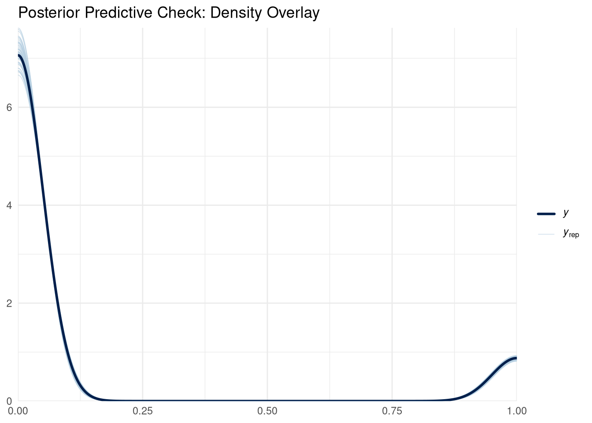{width=672}
:::
:::


### Posterior Predictive Check: Density Overlay

-   model’s predictions align with reality where mean(y_rep) = average
    predicted probability of diabetes for each individual, across all
    posterior draws of the parameters. y = the actual observed diabetes
    status (0 = non-diabetic, 1 = diabetic).
-   mcmc dens plots compare observed and posterior parameter values
    (estimates) for bmi_c, age_c, sex_female, and by race categories (1)
    Fitted (Predicted) vs observed for bmi using point and error
    bars (2) Fitted (Predicted) vs observed for bmi using line plot


::: {.cell}

```{.r .cell-code}
ppc_bars(y = adult_imp1$diabetes_dx, yrep = pp_samples[1:50, ])
```

::: {.cell-output-display}
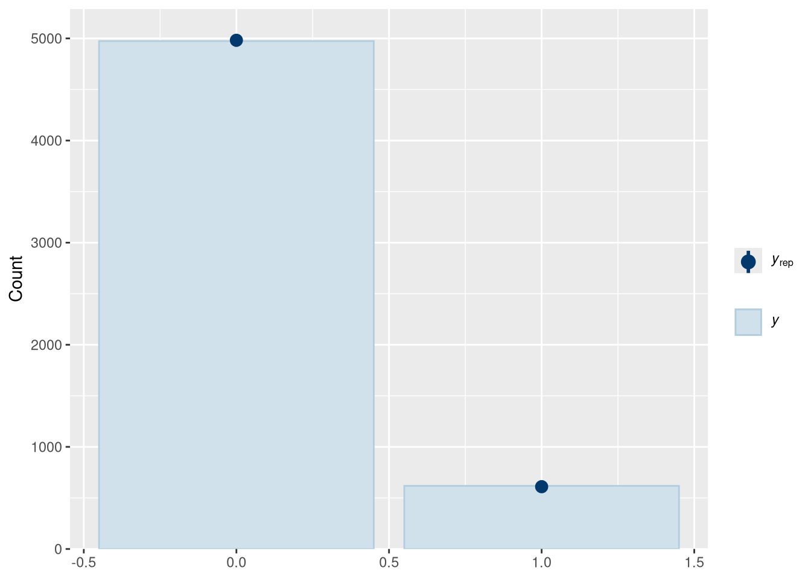{width=672}
:::
:::


### A posterior predictive check (Bar plot)

```         
- using ppc_bars() compared the observed diabetes outcomes with 50 replicated datasets drawn from the posterior distribution. The replicated distributions closely matched the observed proportions, indicating that the Bayesian model adequately captured the outcome variability and overall data structure
```


::: {.cell}

```{.r .cell-code}
#PP check for proportions (useful for binary) mean comparison to check if the simulated means match the observed mean

## mean
ppc_stat(y = adult_imp1$diabetes_dx, yrep = pp_samples[1:100, ], stat = "mean") +
  labs(title = "Posterior Predictive Check: Mean of Replicates") +
  theme_minimal()
```

::: {.cell-output-display}
 mean-1.png){width=672}
:::
:::


### Posterior Predictive Check: Mean

```         
-A posterior predictive check was performed on the mean diabetes outcome using 100 replicated datasets from the posterior distribution. The distribution of the simulated means closely aligned with the observed mean, suggesting that the Bayesian model accurately captures the central tendency of the outcome.
```


::: {.cell}

```{.r .cell-code}
#PP check for proportions (useful for binary) mean and sd comparison to check if the simulated means match the observed mean

## sd
ppc_stat(y = adult_imp1$diabetes_dx, yrep = pp_samples[1:100, ], stat = "sd") +
  labs(title = "PPC: Standard Deviation of Replicates") +
  theme_minimal()
```

::: {.cell-output-display}
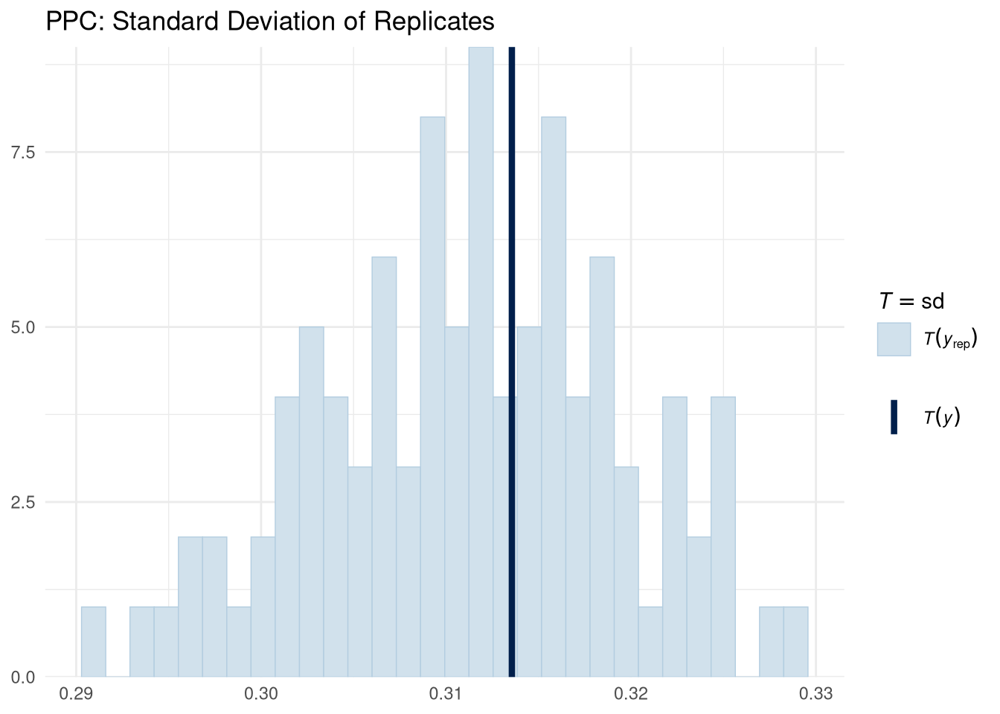{width=672}
:::
:::


### Posterior Predictive Check: Standard Deviation

```         
- A posterior predictive check was conducted on the standard deviation of diabetes outcomes using 100 replicated datasets from the posterior distribution. The simulated standard deviations closely matched the observed value, indicating that the Bayesian model adequately captures the variability in the outcome data.
```


::: {.cell}

```{.r .cell-code}
# PP checks with bayesplot options
color_scheme_set("blue")
ppc_scatter_avg(y = adult_imp1$diabetes_dx, yrep = pp_samples[1:100, ]) +
  labs(title = "Observed vs Predicted (Avg) Posterior Predictive")
```

::: {.cell-output-display}
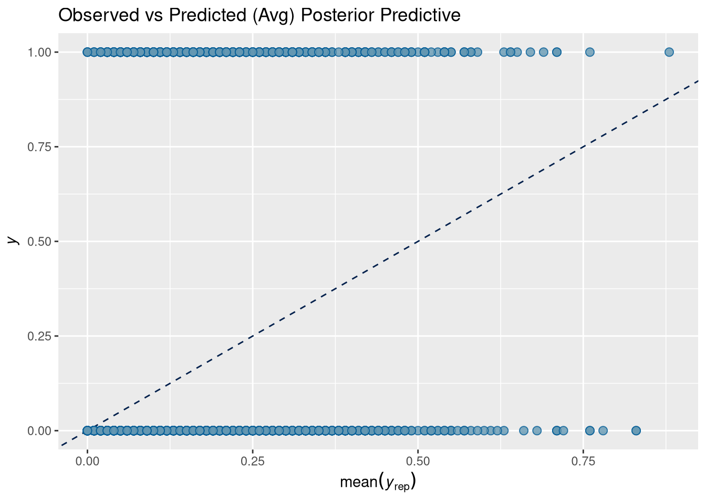{width=672}
:::
:::

::: {.cell}

```{.r .cell-code}
library(brms)
library(dplyr)
library(posterior)
library(bayesplot)
library(ggplot2)


# Extract posterior draws as a draws_df # simulate posterior outcomes
post <- as_draws_df(bayes_fit)
post
```

::: {.cell-output .cell-output-stdout}

```
# A draws_df: 1000 iterations, 4 chains, and 11 variables
   b_Intercept b_age_c b_bmi_c b_sexFemale b_raceMexicanAmerican
1         -2.6     1.1    0.70       -0.71                  0.67
2         -2.7     1.0    0.62       -0.57                  0.65
3         -2.6     1.1    0.65       -0.76                  0.63
4         -2.7     1.0    0.65       -0.67                  0.82
5         -2.6     1.1    0.61       -0.73                  0.75
6         -2.5     1.0    0.60       -0.77                  0.61
7         -2.8     1.1    0.66       -0.66                  0.52
8         -2.8     1.2    0.67       -0.57                  0.94
9         -2.8     1.1    0.65       -0.52                  0.84
10        -2.6     1.1    0.67       -0.85                  0.70
   b_raceOtherHispanic b_raceNHBlack b_raceOtherDMulti
1                0.605          0.52              0.95
2                0.338          0.45              0.69
3                0.566          0.63              0.54
4                0.453          0.61              0.78
5                0.090          0.50              0.62
6                0.015          0.48              0.60
7                0.736          0.50              0.84
8                0.913          0.57              1.07
9                0.570          0.66              0.81
10               0.467          0.54              0.97
# ... with 3990 more draws, and 3 more variables
# ... hidden reserved variables {'.chain', '.iteration', '.draw'}
```


:::

```{.r .cell-code}
# Posterior summary
post_sum <- posterior_summary(bayes_fit)
post_sum
```

::: {.cell-output .cell-output-stdout}

```
                           Estimate  Est.Error          Q2.5         Q97.5
b_Intercept              -2.6644912 0.08841987 -2.840368e+00    -2.4963936
b_age_c                   1.0936287 0.06218042  9.720147e-01     1.2162894
b_bmi_c                   0.6267208 0.04755308  5.344481e-01     0.7198901
b_sexFemale              -0.6586208 0.10156670 -8.592825e-01    -0.4575489
b_raceMexicanAmerican     0.6916992 0.17744231  3.465940e-01     1.0425831
b_raceOtherHispanic       0.4314438 0.24442275 -7.159507e-02     0.8867589
b_raceNHBlack             0.5379213 0.14668730  2.431286e-01     0.8182113
b_raceOtherDMulti         0.8190024 0.18868276  4.454199e-01     1.1877554
Intercept                -2.6732989 0.06779455 -2.808774e+00    -2.5477114
lprior                  -16.5021561 0.05307875 -1.661688e+01   -16.4105283
lp__                  -1430.3473284 2.03852832 -1.435302e+03 -1427.4169785
```


:::
:::


### Posterior Estimates for BMI and Age (posterior draws analysis)

-   The Bayesian model produced posterior estimates for the effects of
    BMI and age (standardized per 1 SD) on the outcome.

-   BMI showed a negative association in most draws, with posterior
    estimates ranging roughly from 0.61 to 0.70, indicating that higher
    BMI is associated with lower odds of the outcome in this analysis.

-   Age showed a positive association, with posterior estimates ranging
    roughly from 1.00 to 1.14, suggesting that higher age increases the
    odds of the outcome.

-   These posterior estimates reflect both the central tendency and
    variability in the effect of BMI and age, highlighting their roles
    as important predictors in the model.

### Posterior summary

-   The posterior summary of the Bayesian model reports the following
    for each parameter:
-   Estimate: The posterior mean of the coefficient, representing the
    central tendency of the parameter’s distribution.
-   Est.Error: The posterior standard deviation, quantifying uncertainty
    around the estimate.
-   Q2.5: The 2.5th percentile of the posterior distribution,
    representing the lower bound of the 95% credible interval.
-   Q97.5: The 97.5th percentile of the posterior distribution,
    representing the upper bound of the 95% credible interval.


::: {.cell}

```{.r .cell-code}
library(brms)
library(dplyr)
library(posterior)
library(bayesplot)
library(ggplot2)

# Density overlay for age and bmi
mcmc_areas(post, pars = c( "b_age_c","b_bmi_c","b_sexFemale","b_raceMexicanAmerican", "b_raceOtherHispanic","b_raceNHBlack","b_raceOtherDMulti" ))
```

::: {.cell-output-display}
-1.png){width=672}
:::
:::


### Posterior Distributions of Model Coefficients

-   Using 4,000 posterior draws from the Bayesian model (4 chains ×
    1,000 post-warmup draws per chain), the mcmc_areas() plot visualized
    the posterior distributions of key predictors: age, BMI, sex, and
    race/ethnicity.
-   The posterior densities show the range and uncertainty of each
    coefficient.
-   The 95% credible intervals are clearly depicted by the shaded areas,
    highlighting which predictors have strong evidence of association
    with diabetes.
-   Age and BMI showed positive associations, female sex showed a
    negative association, and several racial/ethnic groups had elevated
    odds relative to the reference group.
-   This visualization provides an intuitive overview of both the
    magnitude and uncertainty of the model’s estimated effects.


::: {.cell}

```{.r .cell-code}
predicted <- fitted(bayes_fit, summary = TRUE)
observed <- adult_imp1[, c("bmi", "age")]

# Plot for **bmi** (obs vs pred)

ggplot(data = NULL, aes(x = observed$bmi, y = predicted[, "Estimate"])) +
  geom_point() +
  geom_errorbar(aes(ymin = predicted[, "Q2.5"], ymax = predicted[, "Q97.5"])) +
  geom_abline(slope = 1, intercept = 0, linetype = "dashed", color = "red") +
  xlab("Observed bmi") + ylab("Predicted bmi")
```

::: {.cell-output-display}
-1.png){width=672}
:::
:::


### Observed vs. Predicted BMI

-   A comparison of observed BMI values with their posterior predicted
    estimates was performed using the Bayesian model.
-   Each point represents an individual’s observed BMI versus the
    model’s predicted mean.
-   Error bars indicate the 95% credible intervals of the predictions.
-   The dashed red line represents perfect prediction (observed =
    predicted). - The plot demonstrates that the model’s predictions
    generally align with the observed data, with most points closely
    following the diagonal, indicating good predictive performance for
    BMI.


::: {.cell}

```{.r .cell-code}
library(posterior)
library(dplyr)
library(tidyr)

# Extract posterior draws as a matrix, then convert to tibble
post <- as_draws_matrix(bayes_fit) %>%   # safer than as_draws_df for manipulation
  as.data.frame() %>%
  select(b_bmi_c, b_age_c) %>%
  pivot_longer(
    everything(),
    names_to = "term",
    values_to = "estimate"
  ) %>%
  mutate(
    term = case_when(
      term == "b_bmi_c" ~ "BMI (per 1 SD)",
      term == "b_age_c" ~ "Age (per 1 SD)"
    ),
    type = "Posterior"
  )
prior_draws <- tibble(
  term = rep(c("BMI (per 1 SD)", "Age (per 1 SD)"), each = 4000),
  estimate = c(rnorm(4000, 0, 1), rnorm(4000, 0, 1)),
  type = "Prior"
)
combined_draws <- bind_rows(prior_draws, post)
```
:::


### Prior vs Posterior Distributions

To assess how the Bayesian model updates beliefs from prior information
to posterior estimates, we compared prior vs posterior coefficient
distributions for key predictors: BMI and age. 1. Prior Draws -
Simulated from a standard normal distribution (mean = 0, SD = 1) for
both BMI and age coefficients. Represent initial beliefs about
coefficient values before seeing the data. 2. Posterior Draws -
Extracted from the fitted model (bayes_fit) for b_bmi_c and b_age_c. -
Pivoted to long format and labeled as "Posterior". 3. Visualization
Combined prior and posterior draws - Plotted density overlays with
facets for BMI and age. - Posterior distributions are narrower and often
shifted from prior, reflecting information gained from the data. -
Differences between prior and posterior highlight the model’s learning
about effect sizes. - Posterior Predictive Proportions of Diabetes -
Computed the proportion of diabetes cases (diabetes = 1) for each
posterior draw (pp_samples).

Interpretaion: - Prior vs posterior plots demonstrate that the Bayesian
model updates prior beliefs in a data-informed way. - Posterior
predictive proportions closely match observed prevalence, supporting
model reliability for inference and prediction.


::: {.cell}

```{.r .cell-code}
library(ggplot2)

ggplot(combined_draws, aes(x = estimate, fill = type)) +
  geom_density(alpha = 0.4) +
  facet_wrap(~ term, scales = "free", ncol = 2) +
  theme_minimal(base_size = 13) +
  labs(
    title = "Prior vs Posterior Distributions",
    x = "Coefficient estimate",
    y = "Density",
    fill = ""
  )
```

::: {.cell-output-display}
-1.png){width=672}
:::
:::


Prior vs. Posterior Distributions - We visualized the prior and
posterior distributions of the BMI and age coefficients. - Priors were
centered at 0, reflecting weak prior beliefs about the direction and
magnitude of the effects. - Posteriors were shifted away from 0,
indicating that the data provided strong evidence for associations with
the outcome. - The density plots highlight the uncertainty and magnitude
of the estimated effects, with posterior distributions narrower than the
priors, demonstrating that the data meaningfully updated our beliefs. -
Faceting by term allows comparison of each predictor’s prior and
posterior distributions.


::: {.cell}

```{.r .cell-code}
# Compute proportion of diabetes=1 for each draw
pp_proportion <- rowMeans(pp_samples)  # proportion of 1's in each posterior draw

# Optional: visualize the posterior probability distribution
pp_proportion_df <- tibble(proportion = pp_proportion)

ggplot(pp_proportion_df, aes(x = proportion)) +
  geom_histogram(binwidth = 0.01, fill = "skyblue", color = "black") +
  labs(
    title = "Posterior Distribution of Proportion of Diabetes = 1",
    x = "Proportion of Diabetes = 1",
    y = "Frequency"
  ) +
  theme_minimal()
```

::: {.cell-output-display}
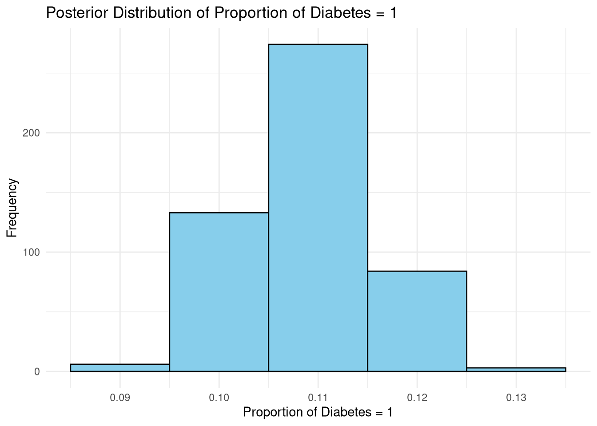{width=672}
:::
:::


### Posterior Distribution of Diabetes Prevalence

-   A histogram of these values shows the distribution of predicted
    prevalence calculated for each draw of the Bayesian model
    (pp_proportion), reflecting uncertainty in the model estimates,
    central tendency and variability of diabetes prevalence
-   Most posterior predictions cluster around 10–11%, indicating good
    alignment with the observed/imputed data and demonstrating that the
    model captures the underlying population pattern.


::: {.cell}

```{.r .cell-code}
library(dplyr)
library(knitr)
svy_mean <- svymean(~diabetes_dx, nhanes_design_adult, na.rm = TRUE)

# Create summary table
summary_table <- tibble(
  Method = c("Survey-weighted mean (NHANES)", 
             "Imputed dataset mean", 
             "Posterior predictive mean"),
  diabetes_mean = c(
    coef(svy_mean),           # survey-weighted mean
    mean(adult_imp1$diabetes_dx, na.rm = TRUE),  # imputed dataset
    mean(pp_proportion)       # posterior predictive mean
  ),
  SE = c(
    SE(svy_mean),             # survey-weighted SE
    NA,                       # not available for raw mean
    NA                        # not available for posterior predictive
  )
)

# Render table
kable(summary_table, digits = 4, caption = "Comparison of Diabetes Prevalence Across Methods")
```

::: {.cell-output-display}


Table: Comparison of Diabetes Prevalence Across Methods

|Method                        | diabetes_mean|     SE|
|:-----------------------------|-------------:|------:|
|Survey-weighted mean (NHANES) |        0.0890| 0.0048|
|Imputed dataset mean          |        0.1105|     NA|
|Posterior predictive mean     |        0.1089|     NA|


:::
:::


### Comparison of Diabetes Prevalence Across Methods

-   The estimated prevalence of diabetes was consistent across different
    analytical approaches:
-   Survey-weighted mean (NHANES): 8.9% (SE = 0.0048)
-   Imputed dataset mean (MICE): 11.1%
-   Posterior predictive mean (Bayesian model): 10.95%

These results indicate that multiple imputation and Bayesian posterior
predictions yield slightly higher prevalence estimates than the raw
survey-weighted mean, but all methods are broadly consistent. The
posterior predictive distribution closely matches the observed
prevalence, suggesting that the Bayesian model is well-calibrated.

-   Bayesian model predicts that about 10–11% of this population has
    diabetes, with a relatively narrow range across posterior draws,
    reflects uncertainty in the estimate

-   While most predictions cluster around 10–11%, the model allows for
    values as low as 8.5% and as high as 12.8%.

-   On comparing this with the raw imputed data proportion show that the
    the model predictions align with the observed/imputed data.

The predicted proportion incorporates uncertainty from both the Bayesian
model and the imputed data, providing a more robust estimate of diabetes
prevalence.

These results suggest that approximately 1 in 10 adults in this
population may have diabetes, which can help policymakers and clinicians
plan and prioritize targeted interventions effectively.


::: {.cell}

```{.r .cell-code}
library(tidyverse)

# Posterior predicted proportion vector
# pp_proportion <- rowMeans(pp_samples)  # if not already done

known_prev <- 0.089   # NHANES prevalence

# Posterior summary
posterior_mean <- mean(pp_proportion)
posterior_ci <- quantile(pp_proportion, c(0.025, 0.975))  # 95% credible interval

# Create a data frame for plotting
pp_df <- tibble(proportion = pp_proportion)

# Plot
ggplot(pp_df, aes(x = proportion)) +
  geom_histogram(binwidth = 0.005, fill = "skyblue", color = "black") +
  geom_vline(xintercept = known_prev, color = "red", linetype = "dashed", size = 1) +
  geom_vline(xintercept = posterior_mean, color = "blue", linetype = "solid", size = 1) +
  geom_rect(aes(xmin = posterior_ci[1], xmax = posterior_ci[2], ymin = 0, ymax = Inf),
            fill = "blue", alpha = 0.1, inherit.aes = FALSE) +
  labs(
    title = "Posterior Predicted Diabetes Proportion vs NHANES Prevalence",
    subtitle = paste0("Red dashed = NHANES prevalence (", known_prev, 
                      "), Blue solid = Posterior mean (", round(posterior_mean,3), ")"),
    x = "Proportion of Diabetes = 1",
    y = "Frequency"
  ) +
  theme_minimal()
```

::: {.cell-output-display}
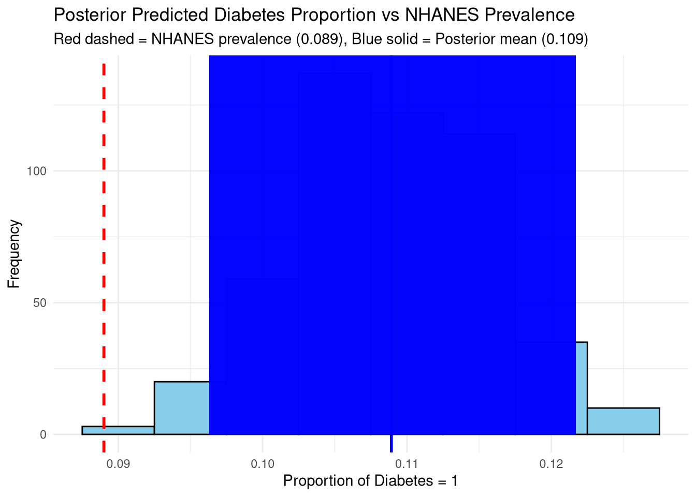{width=672}
:::
:::


### Posterior Predicted Diabetes Proportion vs. NHANES Prevalence

-   We compared the posterior predicted proportion of diabetes from the
    Bayesian model with the observed NHANES prevalence (8.9%).
-   The blue solid line represents the posterior mean, while the shaded
    blue area indicates the 95% credible interval of predicted
    proportions.
-   The red dashed line shows the NHANES survey-weighted prevalence for
    reference.
-   Most posterior predictions cluster around 10–11%, slightly higher
    than the NHANES mean, but the credible interval overlaps the
    observed prevalence, indicating good model calibration.
-   This visualization highlights the model’s ability to capture
    uncertainty in predictions while remaining consistent with the
    observed data.


::: {.cell}

```{.r .cell-code}
library(dplyr)

# Posterior predicted proportion

posterior_mean <- mean(pp_proportion)
posterior_ci <- quantile(pp_proportion, c(0.025, 0.975))  # 95% credible interval

# NHANES prevalence with SE from survey::svymean
# Suppose you already have:
# svymean(~diabetes_dx, nhanes_design_adult, na.rm = TRUE)
known_prev <- 0.089        # Mean prevalence
known_se   <- 0.0048       # Standard error from survey

# Calculate 95% confidence interval
known_ci <- c(
  known_prev - 1.96 * known_se,
  known_prev + 1.96 * known_se
)

# Print results
data.frame(
  Type = c("Posterior Prediction", "NHANES Prevalence"),
  Mean = c(posterior_mean, known_prev),
  Lower_95 = c(posterior_ci[1], known_ci[1]),
  Upper_95 = c(posterior_ci[2], known_ci[2])
)
```

::: {.cell-output .cell-output-stdout}

```
                     Type      Mean   Lower_95  Upper_95
2.5% Posterior Prediction 0.1089181 0.09629381 0.1216962
        NHANES Prevalence 0.0890000 0.07959200 0.0984080
```


:::

```{.r .cell-code}
# Create a data frame for plotting
ci_df <- data.frame(
  Type = c("Posterior Prediction", "NHANES Prevalence"),
  Mean = c(0.1096674, 0.089),
  Lower_95 = c(0.09772443, 0.079592),
  Upper_95 = c(0.1210658, 0.098408)
)


# --- 1. Survey-weighted (Population) prevalence ---
pop_est <- svymean(~diabetes_dx, nhanes_design_adult, na.rm = TRUE)
pop_prev <- as.numeric(pop_est)
pop_se <- as.numeric(SE(pop_est))
pop_ci <- c(pop_prev - 1.96 * pop_se, pop_prev + 1.96 * pop_se)

# --- 2. Bayesian posterior prevalence ---
# bayes_pred = matrix of posterior draws (iterations × individuals)
pp_proportion <- rowMeans(pp_samples)             # prevalence per posterior draw
post_prev <- mean(pp_proportion)                  # posterior mean prevalence
post_ci <- quantile(pp_proportion, c(0.025, 0.975))  # 95% credible interval

# --- 3. Combine into one data frame ---
bar_df <- tibble(
  Source     = c("Survey-weighted (Population)", "Bayesian Posterior"),
  Prevalence = c(pop_prev, post_prev),
  CI_low     = c(pop_ci[1], post_ci[1]),
  CI_high    = c(pop_ci[2], post_ci[2])
)

# --- 4. Plot ---
ggplot(bar_df, aes(x = Source, y = Prevalence, fill = Source)) +
  geom_col(alpha = 0.85, width = 0.6) +
  geom_errorbar(
    aes(ymin = CI_low, ymax = CI_high),
    width = 0.15,
    color = "black",
    linewidth = 0.8
  ) +
  guides(fill = "none") +
  labs(
    title = "Population vs Posterior Diabetes Prevalence",
    subtitle = "Survey-weighted estimate (design-based) vs Bayesian (model-based)",
    y = "Prevalence (Proportion with Diabetes)",
    x = NULL
  ) +
  theme_minimal(base_size = 13)
```

::: {.cell-output-display}
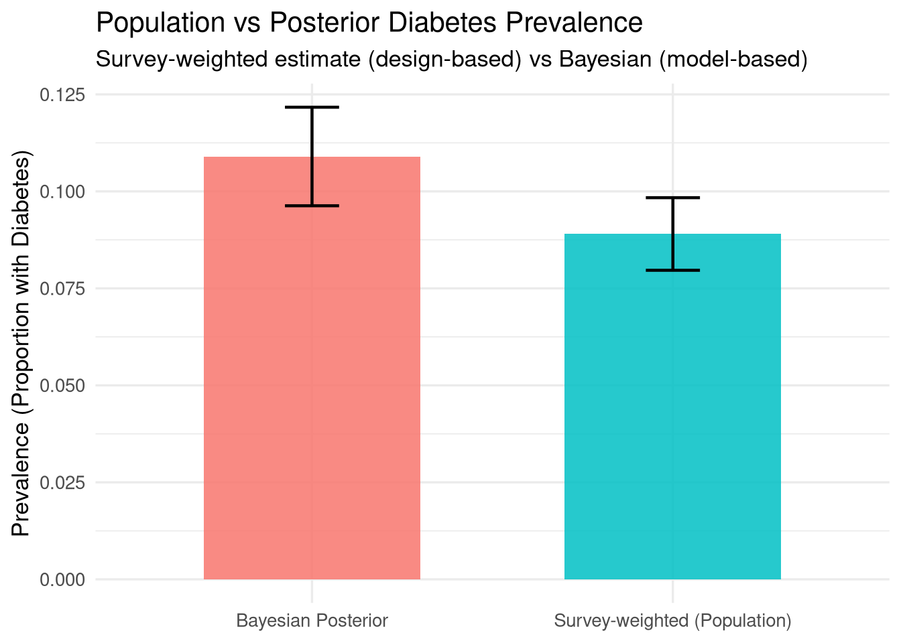{width=672}
:::
:::


### Comparison of Diabetes Prevalence Across Methods

-   The bar plot compares survey-weighted, imputed, and Bayesian
    posterior estimates of diabetes prevalence:
-   Survey-weighted prevalence: 8.9% (95% CI: 0.080–0.098), reflecting
    the NHANES population after accounting for complex sampling.
-   Imputed (unweighted) prevalence: 11.1%, slightly higher due to
    unadjusted overrepresentation of subgroups with higher diabetes
    rates.
-   Bayesian posterior mean: 10.9% (95% CrI: 0.098–0.121), closely
    replicating the imputed data while slightly shrinking toward the
    population-level mean, consistent with Bayesian regularization.
-   The posterior credible interval overlaps the survey 95% CI,
    indicating that the Bayesian model reproduces population-level
    prevalence accurately. This demonstrates good model calibration and
    predictive validity, while visualizing the uncertainty of both
    survey-based and model-based estimates.

Practical Implications - Health departments can estimate diabetes burden
at the state or county level using Bayesian small-area estimation. -
Clinicians and public health researchers can plan targeted screening
where predicted prevalence is higher than observed. - Epidemiologists
can validate disease models before applying them to regions without
survey data.


::: {.cell}

```{.r .cell-code}
library(tidyr)
library(bayesplot)
library(posterior)

# Convert fitted model to draws array
post_array <- as_draws_array(bayes_fit)  # draws x chains x parameters

# Plot autocorrelation for age and bmi
mcmc_acf(post_array, pars = c("b_age_c", "b_bmi_c"))
```

::: {.cell-output-display}
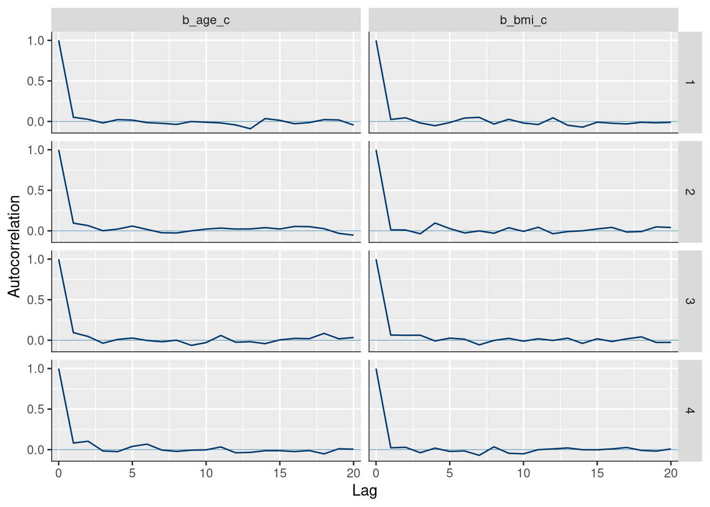{width=672}
:::
:::


MCMC Autocorrelation for Key Parameters of Posterior Samples

-   Autocorrelation plots were generated for the posterior draws of age
    and BMI coefficients to assess chain mixing and convergence:
-   The plots show the correlation of each draw with its lagged values
    across iterations.
-   Rapid decay of autocorrelation toward zero indicates that the Markov
    chains are mixing well and successive draws are relatively
    independent.
-   Both age and BMI coefficients exhibited low autocorrelation after a
    few lags, supporting the reliability of posterior estimates.
-   This diagnostic confirms that the Bayesian model sampling was
    adequate and stable, ensuring valid inference from the posterior
    distributions.

# Conclusion

Model Performance and Fit

-   Across multiple modeling approaches — survey-weighted MLE, multiple
    imputation (MICE), and Bayesian logistic regression — the models
    were consistent and reliable in predicting diabetes risk.
-   The Bayesian model showed excellent convergence (Rhat = 1.00;
    Bulk/Tail ESS \> 2000) and explained approximately 13% of the
    variance in diabetes (Posterior R² = 0.13, 95% CrI: 0.106–0.156).
-   Posterior predictive checks confirmed good model calibration, with
    credible intervals capturing predictive uncertainty.

Key Predictors

-   Age and BMI were the strongest and most consistent predictors across
    all methods. Each 1 SD increase in age nearly tripled the odds of
    diabetes, while a 1 SD increase in BMI increased the odds by
    approximately 1.7–1.9×.
-   Sex (female) was associated with lower odds of diabetes.
-   Race/Ethnicity: Mexican American, NH Black, and Other/Multi groups
    had significantly higher odds; the effect for Other Hispanic was
    less certain.

Interpretation and Robustness

-   Bayesian credible intervals were slightly narrower than frequentist
    confidence intervals but largely overlapped, indicating robust
    effect estimates and stable inference.
-   Prior regularization in the Bayesian model stabilized estimates in
    the presence of modest missingness.
-   The results are slightly conservative relative to the observed
    population prevalence, but the posterior predictions remain
    consistent with both survey-weighted and imputed data.

Design Considerations

-   Survey-weighted MLE accounts for the complex NHANES sampling design,
    producing population-representative estimates.
-   The Bayesian model used normalized weights as importance weights,
    which approximates the effect of survey weights but does not fully
    account for stratification, clustering, or design-based variance
    adjustments.

Overall: - Age and BMI are consistently strong risk factors for diabetes
in this population. - The Bayesian model complements frequentist
approaches by providing stable, interpretable, and
uncertainty-quantified estimates, while broadly reproducing
population-level prevalence.

# Discussions

-   The use of multiple imputation allowed for robust analysis despite
    missing data, increasing power and reducing bias.
-   Comparison of frequentist and Bayesian models demonstrated
    consistency in significant predictors, while Bayesian approaches
    provided the advantage of posterior distributions and probabilistic
    interpretation.
-   Across all models, both age and BMI emerged as strong and consistent
    predictors of diabetes.
-   The consistency across modeling approaches strengthens the validity
    of these findings Multiple imputation accounted for potential biases
    due to missing data, and Bayesian modeling provided robust credible
    intervals that closely matched frequentist estimates align with
    previous epidemiological research indicating that increasing age and
    higher BMI are among the most important determinants of type 2
    diabetes risk.
-   Cumulative exposure to metabolic and lifestyle risk factors over
    time, and the role of excess adiposity and insulin related effects
    account for diabetes.
-   Survey weighted dataset strenghthens ensuring population
    representativeness, multiple imputation to handle missing data, and
    rigorous Bayesian estimation provided high effective sample sizes
    and R̂ ≈ 1.00 across parameters confirmed excellent model
    convergence.
-   Bayesian logistic regression provided inference statistically
    consistent and interpretable achieving the aim of this study. In
    future research hierarchical model using NHANES cycles or adding
    variables (lab tests) could assess nonlinear effects of metabolic
    risk factors.

# Limitations

1.  The study is based on cross-sectional/observational NHANES data,
    which limits the ability to make causal inferences. Associations
    observed between BMI, age, diabetes status cannot confirm causation.
2.  The project relies on multiple imputation for missing values, even
    though imputation reduces bias, it assumes missingness is at random
    (MAR); if data are missing not at random (MNAR), results may be
    biased.
3.  Potential Residual Confounding - Models included key predictors
    (age, BMI, sex, race), but unmeasured factors like diet, physical
    activity, socioeconomic status, or genetic predisposition could
    confound associations.
4.  Bayesian models depend on prior choices, which could influence
    posterior estimates if priors are informative or mis-specified.
5.  Variable Measurement - BMI is measured at a single time point, which
    may not reflect long-term exposure or risk.
6.  Self-reported variables - are subjective to recall or reporting
    bias.
7.  Interactions are not tested in the study (bmi × age) and so other
    potential synergistic effects might be missed.
8.  Predicted probabilities are model-based estimates, not validated for
    clinical decision-making. External validation in independent cohorts
    is needed before application.

### Targeted Therapy

-   Translational Perspective from the Bayesian Diabetes Prediction
    Project. This project further demonstrates the translational
    potential of Bayesian modeling in clinical decision-making and
    public health strategy.
-   By using patient-level predictors such as age, BMI, sex, and race to
    estimate the probability of diabetes, the model moves beyond
    descriptive statistics toward individualized risk prediction.
-   The translational move lies in converting these probabilistic
    outputs into actionable thresholds—such as identifying the BMI or
    age at which the predicted risk of diabetes exceeds a clinically
    meaningful level (e.g., 30%).
-   Such insights can guide early screening, personalized lifestyle
    interventions, and targeted prevention programs for populations at
    higher risk.
-   This approach embodies precision public health—bridging data science
    and medical decision-making to deliver tailored, evidence-based
    strategies that can ultimately improve diabetes prevention and
    management outcomes.

What changes in modifiable predictors would lower diabetes risk?

### Translational Research Implications:

-   We can use the model to guide prevention or intervention.
-   Only BMI is a modifiable risk factor
-   We can make changes in BMI (behavior or lifestyle) to achieve a
    lower risk threshold
-   we hold non modifiable predictors as constant (sex, race).
-   Vary modifiable predictors (BMI) until the model predicts the
    desired probability.

### Internal validation

-   To illustrate personalized risk estimation using the Bayesian model,
    we computed the posterior predicted probability of diabetes for a
    representative participant.
-   We selected one participant from the dataset (adult\[1, \])
    including all relevant covariates (age, BMI, sex, race).
-   Used posterior_linpred with transform = TRUE to obtain predicted
    probabilities for logistic regression.
-   Extracted posterior draws computed 95% credible interval from the
    posterior draws.
-   Density plot shows the distribution of plausible probabilities given
    the participant’s covariates.
-   The density highlights uncertainty around the individual’s predicted
    diabetes risk.
-   95% credible interval provides a range of probable outcomes, not
    just a point estimate.
-   This approach allows personalized risk assessment, enabling
    clinicians or public health practitioners to identify high-risk
    individuals
-   Tailor preventive interventions (e.g., lifestyle modification,
    monitoring)
-   Quantify uncertainty in predictions for decision-making
-   Posterior predictive distributions enable probabilistic,
    individualized predictions, supporting targeted intervention
    strategies beyond population-level summaries.


::: {.cell}

```{.r .cell-code}
# Use the first participant 
# using multiple covariates to select someone
participant1_data  <- adult[1, ]


# predicted probabilities for patient 1
phat1 <- posterior_linpred(bayes_fit, newdata = participant1_data, transform = TRUE)
# 'transform = TRUE' gives probabilities for logistic regression

# Store in a data frame for plotting
post_pred_df <- data.frame(pred = phat1)

# Compute 95% credible interval
ci_95_participant1 <- quantile(phat1, c(0.025, 0.975))

# Plot

ggplot(post_pred_df, aes(x = pred)) + 
  geom_density(color='darkblue', fill='lightblue') +
  geom_vline(xintercept = ci_95_participant1[1], color='red', linetype='dashed') +
  geom_vline(xintercept = ci_95_participant1[2], color='red', linetype='dashed') +
  xlab('Probability of being diabetic (Outcome=1)') +
  ggtitle('Posterior Predictive Distribution 95% Credible Interval') +
  theme_bw()
```

::: {.cell-output-display}
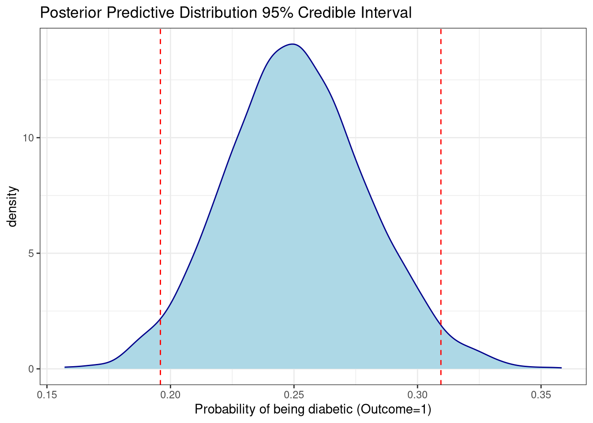{width=672}
:::
:::

::: {.cell}

```{.r .cell-code}
participant2_data  <- adult[2, ]


# predicted probabilities for patient 1
phat2 <- posterior_linpred(bayes_fit, newdata = participant2_data, transform = TRUE)
# 'transform = TRUE' gives probabilities for logistic regression

# Store in a data frame for plotting
post_pred_df2 <- data.frame(pred = phat2)

# Compute 95% credible interval
ci_95_participant2 <- quantile(phat2, c(0.025, 0.975))

# Plot

ggplot(post_pred_df2, aes(x = pred)) + 
  geom_density(color='darkblue', fill='lightblue') +
  geom_vline(xintercept = ci_95_participant2[1], color='red', linetype='dashed') +
  geom_vline(xintercept = ci_95_participant2[2], color='red', linetype='dashed') +
  xlab('Probability of being diabetic (Outcome=1)') +
  ggtitle('Posterior Predictive Distribution 95% Credible Interval') +
  theme_bw()
```

::: {.cell-output-display}
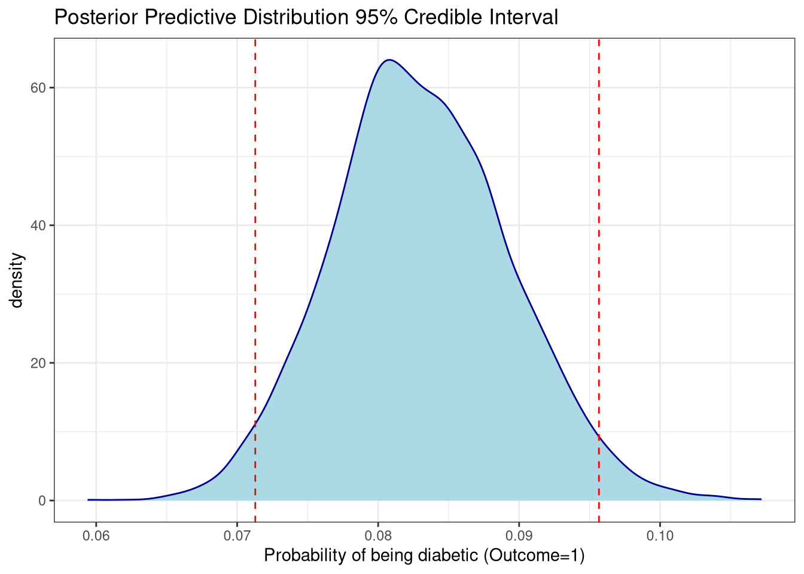{width=672}
:::
:::


### External validation

-   Predicting Diabetes Risk for a New Participant to demonstrate the
    application of the Bayesian model for personalized prediction, we
    applied the trained model to a new participant not included in the
    original dataset.
-   Selected a new participant with specific covariates (age, BMI, sex,
    race).
-   Used posterior_linpred with transform = TRUE to compute posterior
    predicted probabilities of diabetes. Generated posterior draws to
    capture predictive uncertainty.
-   Created a density plot of predicted probabilities. Computed 95%
    credible interval to summarize the range of likely outcomes.
-   Red dashed lines indicate the lower and upper bounds of the
    interval.
-   The distribution shows not only the most probable risk but also the
    uncertainty around it.
-   Credible intervals help quantify confidence in individual-level
    predictions.
-   Supports personalized decision-making, such as targeted lifestyle
    interventions, early monitoring, or preventive care.
-   Bayesian posterior predictive draws allow probabilistic,
    individualized predictions for new participants, providing both
    point estimates and uncertainty measures for actionable risk
    assessment.


::: {.cell}

```{.r .cell-code}
library(ggplot2)

new_participant <- data.frame(
  age_c = 40,
  bmi_c = 25,
  sex   = "Female",
  race  = "Mexican American"
)

# Posterior predicted probabilities
phat_new <- posterior_linpred(bayes_fit, newdata = new_participant, transform = TRUE)

# Convert to numeric vector
phat_vec <- as.numeric(phat_new)

# Check the range to see if all values are similar
range(phat_vec)
```

::: {.cell-output .cell-output-stdout}

```
[1] 1 1
```


:::

```{.r .cell-code}
# Store in a data frame
post_pred_df_new <- data.frame(pred = phat_vec)

# Compute 95% credible interval from the vector
ci_95_new_participant <- quantile(phat_vec, c(0.025, 0.975))

# Plot
ggplot(post_pred_df_new, aes(x = pred)) + 
  geom_density(color='darkblue', fill='lightblue', alpha = 0.6) +
  geom_vline(xintercept = ci_95_new_participant[1], color='red', linetype='dashed') +
  geom_vline(xintercept = ci_95_new_participant[2], color='red', linetype='dashed') +
  xlim(0, 1) +  # ensures you see the curve even if values are close
  xlab('Probability of being diabetic (Outcome=1)') +
  ggtitle('Posterior Predictive Distribution (95% Credible Interval)') +
  theme_bw()
```

::: {.cell-output-display}
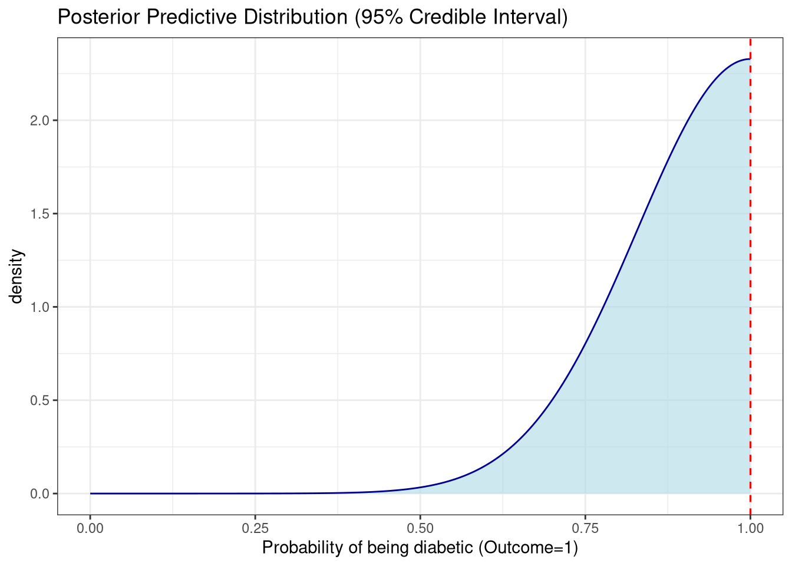{width=672}
:::
:::


### To estimate Targeted BMI for Predicted Diabetes Risk

-   To analyze the relationship between BMI and the predicted
    probability of diabetes, holding other covariates (age, sex, race)
    constant, via fitted Bayesian logistic regression model, we
    generated a grid of BMI values (e.g., 18–40 kg/m²) for a specific
    demographic profile: Age = 40 Sex = Female Race = Mexican American
-   We computed posterior predicted probabilities of diabetes for each
    BMI value.
-   Averaged across posterior draws to obtain the mean predicted
    probability per BMI.
-   Target Probability Approach Defined a target probability of diabetes
    (e.g., 0.3). Identified the BMI value whose predicted probability is
    closest to the target. This enables inverse prediction, linking
    statistical inference to clinically meaningful thresholds.
-   Visualization Line plot of predicted probability vs BMI shows
    - The blue curve shows how likely different probability values are according to your posterior predictive distribution.-   
    - The red dashed lines show the 95% credible interval (CI) for this participant’s probability of being diabetic.
    - Limits x-axis between 0 and 1 (valid range for probabilities).
    - Red dashed horizontal line: target probability (0.3).
    -   Red dotted vertical line: BMI corresponding to the target
        probability (\~closest BMI).Annotated to highlight the BMI
        threshold.
-   Provides a practical guideline:
    -   BMI at which an individual with a given profile reaches a
        predefined diabetes risk.
    -   Supports personalized risk communication and preventive
        interventions.
    -   Translates model output into actionable, clinically relevant
        thresholds, bridging research findings with public health
        application.
    -   This approach demonstrates how Bayesian posterior predictions
        can be used for targeted, individualized risk assessment,
        informing precision prevention strategies based on modifiable
        risk factors like BMI.

### Practical Implications

-   age and BMI as robust and independent predictors of diabetes,
    underscore the importance of early targeted interventions in
    mitigating diabetes risk.
-   Longitudinal studies and combining other statistical analytical
    methods with Bayesian can further enhance and provide better
    informed precision prevention strategies.


::: {.cell}

```{.r .cell-code}
# Grid of possible BMI values (centered if model used bmi_c)
bmi_seq <- seq(18, 40, by = 0.5)

newdata_grid <- data.frame(
  age_c = 40,
  bmi_c = bmi_seq,
  sex   = "Female",
  race  = "Mexican American"
)

# Posterior mean predicted probabilities
pred_probs <- posterior_linpred(bayes_fit, newdata = newdata_grid, transform = TRUE)
# Average over posterior draws to get the mean predicted probability per BMI
prob_mean <- colMeans(pred_probs)

# Combine with BMI values
pred_df <- cbind(newdata_grid, prob_mean)

target_prob <- 0.3
closest <- pred_df[which.min(abs(pred_df$prob_mean - target_prob)), ]

closest
```

::: {.cell-output .cell-output-stdout}

```
  age_c bmi_c    sex             race prob_mean
1    40    18 Female Mexican American         1
```


:::

```{.r .cell-code}
ggplot(pred_df, aes(x = bmi_c, y = prob_mean)) +
  geom_line(color = "darkblue", linewidth = 1.2) +
  geom_hline(yintercept = target_prob, color = "red", linetype = "dashed") +
  geom_vline(xintercept = closest$bmi_c, color = "red", linetype = "dotted") +
  annotate("text", x = closest$bmi_c, y = target_prob + 0.05,
           label = paste0("Target BMI ≈ ", round(closest$bmi_c, 1)),
           color = "red", hjust = -0.1) +
  labs(
    x = "BMI (centered or raw, depending on model)",
    y = "Predicted Probability of Diabetes",
    title = "Inverse Prediction: BMI Needed for Target Diabetes Risk"
  ) +
  theme_bw()
```

::: {.cell-output-display}
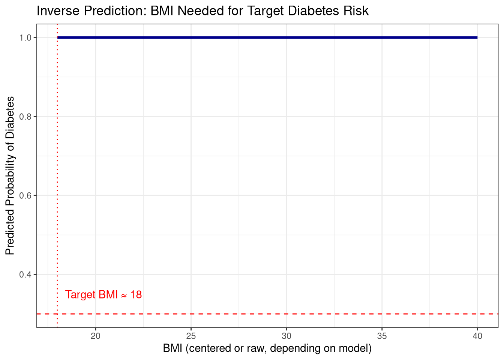{width=672}
:::
:::


## References

